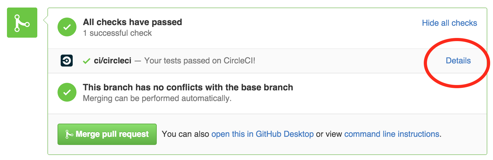

[](https://circleci.com/gh/stan-ja/stan-ja)

# Modeling Language User’s Guide and Reference Manual, v2.16.0 (日本語訳)

最新版の翻訳 PDF は [releases](https://github.com/stan-ja/stan-ja/releases) から取得できます。

## 目的
[Modeling Language User’s Guide and Reference Manual, v2.16.0](https://github.com/stan-dev/stan/releases/download/v2.16.0/stan-reference-2.16.0.pdf) の日本語訳の作成です.

## 文章のルール
* Markdown形式で書く
  * [参考リンク1 (pdf)](http://packetlife.net/media/library/16/Markdown.pdf)
  * [参考リンク2](http://qiita.com/Qiita/items/c686397e4a0f4f11683d) QiitaのMarkdownとは数式の部分だけは異なるので注意.
  * [参考リンク3](https://github.com/adam-p/markdown-here/wiki/Markdown-Cheatsheet)
  * プレビューに使えるサイトはいくつかあります. [wri.pe](https://wri.pe/)などです.
* Part XX は #
* Chapter は ##
* sub chapter は ###
* 文体は丁寧語にしてください.
* 句読点は翻訳者の自由にしてください. 最終的なpdfとhtmlにする時には`。`を`. `に, `、`を`, `に置換します.
* ブロック数式は以下の3択の中から翻訳者が自由に選んでください. 1番目推奨です.
  * 3番目の方法はweb上（Github上）ではレンダリングされませんが, pdf/html化する時には反映されます.
  * 1番目の方法は面倒ですがweb上で見れてpdf/htmlも綺麗なので余裕があればお願いします.
  * cf. [chap41](https://github.com/stan-ja/stan-ja/blob/master/part07/chap41/chap41.md)

```

```

```

```

```
$$ TeX記法 $$
```

* インライン数式は`$`と`$`で囲んでTeX記法を使ってください.
* 複数行に渡るStanコードは\`\`\`と\`\`\`で囲む
* インラインのStanコードは\`と\`で囲む
* 自信のない箇所は英文のままにしておく. できれば, \*\*\`と\`\*\*で囲んで強調しておく.


## 運用のルールとgitの初歩

* 作業はbranchを切ってからおねがいします．
	* ブランチ名は新しく記事を作成する場合は接頭語に `create/` をつける
	* 修正する場合は `fix/` をつける
	* それ以外の例外的な部分も作業内容がわかるようにbranch名を決めて頂けると幸いです．

* レビュワーはPullRequest時に募りましょう．2～3名いることが望ましいです．
	* その他有志のレビュー歓迎です．
* レビュワーのlgtmがでたら作業者は確認のうえでmaster branchにmerge!


### チームで翻訳する，大まかな流れ
* 最新のremoteにあるmaster branchを取得します．

```
git checkout master
git pull origin master
```

レポジトリ自体を初めて取得する場合は

```
git clone https://github.com/stan-ja/stan-ja
```

* 作業用のbranchを切ります

```
git checkout -b 'create/partxx/chapyy'
```

* 修正したファイルをgitのインデックスに登録します

```
git add hoge/huga.md
```

* インデックスに追加した更新をローカルブランチにcommitします

何を修正したのかがわかるようにコミットメッセージを追加しましょう．
```
git commit -m '１章を翻訳しました＜＜コミットメッセージ'
```

* コミット内容をリモートブランチにpushします

```
git push origin create/partxx/chapyy
```

* github上からmaster branchに対するpull requestを送ります．

* レビュワーの意見を元に再度修正を行い `add` > `commit` > `push` を行います

* レビュワーからの問題なしのサインが出たらそのbranchをmasterにmergeします
	* この「問題なし」のサインはしばしばLGTM (looks good to me = いいと思うよ)と呼ばれています．


### 翻訳結果の確認

GitHub上でpull requestを作成すると[CircleCI](https://circleci.com/)で自動的にPDFに変換処理が行われます。
pull requestページのcommit履歴の横にチェックマークまたはバツ印がつきます。
これらはCircleCIのビルドページへのリンクになっています。

ビルドが成功している場合はArtifactsというタブが表示されます（ログインしている必要があります）。
その中にPDFへのリンクが表示されています。
ビルドが失敗している場合はTest Resultsというタブの`$ build/build_chapter.sh`というブロックをクリックするとエラー詳細が表示されます。




## 参考サイト

* [英語のコメントやissueで頻出する略語の意味](http://qiita.com/uasi/items/86c3a09d17792ab62dfe)
* [LGTM画像はこちらから](http://www.lgtm.in/)


