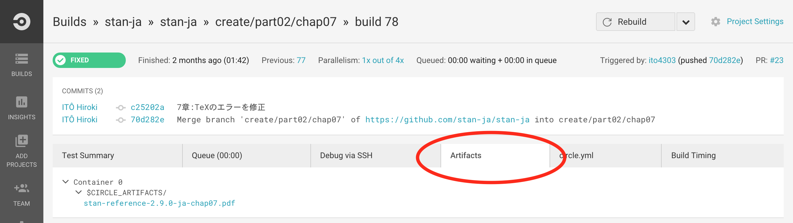

[](https://circleci.com/gh/stan-ja/stan-ja)

# Modeling Language User’s Guide and Reference Manual, v2.16.0 (日本語訳)

最新版の翻訳 pdf は [releases](https://github.com/stan-ja/stan-ja/releases) から取得できます。

## 目的
[Modeling Language User’s Guide and Reference Manual, v2.16.0](https://github.com/stan-dev/stan/releases/download/v2.16.0/stan-reference-2.16.0.pdf) の日本語訳の作成です.

## 文章のルール
pdf（閲覧したい）とhtml（検索エンジンでヒットさせたい）の両方へ自動的に変換したいためMarkdownを採用しました（そのため, 変換は便利ですが数式やリファレンスの記述でやや苦労しています）.

### Markdown関連
* Markdown形式で書く
  * [参考リンク1 (pdf)](http://packetlife.net/media/library/16/Markdown.pdf)
  * [参考リンク2](http://qiita.com/Qiita/items/c686397e4a0f4f11683d) QiitaのMarkdownとは数式の部分だけは異なるので注意.
  * [参考リンク3](https://github.com/adam-p/markdown-here/wiki/Markdown-Cheatsheet)
  * プレビューに使えるサイトはいくつかあります. [wri.pe](https://wri.pe/)などです.
* Part XX は #
* Chapter は ##
* sub chapter は ###

### 文体関連
* 文体は丁寧語にしてください.
* 句読点は翻訳者の自由にしてください. 最終的なpdfとhtmlにする時には`。`を`. `に, `、`を`, `に置換します.

### 数式関連
* ブロック数式は以下の3択の中から翻訳者が自由に選んでください. 1番目推奨です.
  * 3番目の方法はweb上（Github上）ではレンダリングされませんが, pdf/html化する時には反映されます.
  * 1番目の方法は面倒ですがweb上で見れてpdf/htmlも綺麗なので余裕があればお願いします.
  * cf. [chap41](https://github.com/stan-ja/stan-ja/blob/master/part07/chap41/chap41.md)

```

```

```

```

```
$$ TeX記法 $$
```

* TeX記法を統一するための議論も[ここ](https://github.com/stan-ja/stan-ja/issues/28)に存在します.
* 現状pandocで数式のhtmlへの変換がうまくいっていません（[issue67](https://github.com/stan-ja/stan-ja/issues/67)）. pandocに詳しい人募集中です.
* インライン数式は`$`と`$`で囲んでTeX記法を使ってください.

### ソースコードやその他のルール
* 複数行に渡るStanコードは\`\`\`と\`\`\`で囲む
* インラインのStanコードは\`と\`で囲む
* 自信のない箇所は英文のままにしておく. できれば, \*\*\`と\`\*\*で囲んで強調しておく.
* 脚注については、「次のStanのプログラムを考えましょう。\^\[このモデルは\<https://github.com/stan-dev/example-models/tree/master/misc/cluster\>から入手可能です。\]」のようにします。

## 運用のルールとgitの初歩
### 運用のルール

* [章の担当決めテーブル](https://github.com/stan-ja/stan-ja/wiki/%E7%AB%A0%E3%81%AE%E6%8B%85%E5%BD%93%E6%B1%BA%E3%82%81) にアカウント名を記入します。それが作業開始の宣言になります。
* [訳語の統一](https://github.com/stan-ja/stan-ja/wiki/%E8%A8%B3%E8%AA%9E%E3%81%AE%E7%B5%B1%E4%B8%80) を読みましょう.
  * 訳語の議論をしたい場合は[ここ](https://github.com/stan-ja/stan-ja/issues/20)で行っています.

### 翻訳の流れ
* 作業のはじめに, 各自のPCからGitHub上の最新のmaster branchを取得します．
* 各自のPCでbranchを切ります.
	* 新しく記事を作成する場合は, ブランチ名の接頭語に `create/` をつけます.
	* 修正する場合は, ブランチ名の接頭語に `fix/` をつけます.
  * ブランチ名に `fix/chapXX` のように `chapXX` が含まれているとPull Request作成時にpdfが自動で作られます. レビューに便利です.
	* それ以外の例外的な部分も作業内容がわかるようにbranch名を決めてください．
* 翻訳します.
* addおよびcommitします. そしてGitHubへそのbranchをpushします.
* GitHub上で「そのbranchをmaster branchへマージするためのPull Request」を作成します. レビュワーを募ります（最低1名）.
* レビュワーはレビューをします.
  * レビュワーはPull Request上でコメントします. 「Files changed」のページで行単位でコメントできます.
  * 「Pull Requestの際に作られるpdfやhtml」「GitHub上のMarkdown表示」を見ながらレビューを行います.
  * レビュワーの指摘を受けて, 訳者はコメントに返事をしたり, 議論します.　
  * 各自のPCで訳を修正して, commitおよび同じbranchにpushします.
* レビュワーのLGTM（Looks Good To Me = いいと思うよ）が出るまで上記のレビューを繰り返します.
* 松浦もしくは訳者がPull Requestをmergeします.

### gitの初歩

* master branchを取得

```
git checkout master
git pull origin master
```

レポジトリ自体を初めて取得する場合は

```
git clone https://github.com/stan-ja/stan-ja
```

* 作業用のbranchを切る

```
git checkout -b 'create/partXX/chapYY'
```

* 修正したファイルをステージングする

```
git add hoge/huga.md
```

* インデックスに追加した更新をローカルブランチにcommitする

何を修正したのかがわかるようにコミットメッセージを追加しましょう．
```
git commit -m '1章を翻訳しました'
```

* コミット内容をリモートブランチにpushする

```
git push origin create/partXX/chapYY
```

### Pull Request作成時にできるpdfへのリンクが見つからない場合の確認方法

GitHub上でPull Requestを作成すると[CircleCI](https://circleci.com/)で自動的にpdfに変換処理が行われます.
Pull Requestページのcommit履歴の横にチェックマークまたはバツ印がつきます. これらはCircleCIのビルドページへのリンクになっています.

ビルドが成功している場合はArtifactsというタブが表示されます（ログインしている必要があります）.
その中にpdfへのリンクが表示されています.
ビルドが失敗している場合はTest Resultsというタブの`$ build/build_chapter.sh`というブロックをクリックするとエラー詳細が表示されます.




## 参考サイト

* [英語のコメントやissueで頻出する略語の意味](http://qiita.com/uasi/items/86c3a09d17792ab62dfe)
* [LGTM画像はこちらから](http://www.lgtm.in/)
