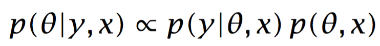
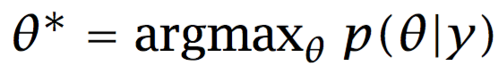
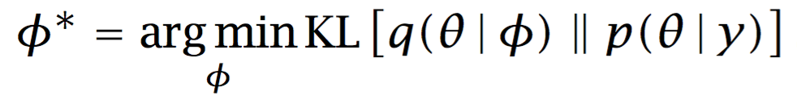

# Overview
このドキュメントは統計モデリング言語であるStanのユーザーガイド，リファレンスマニュアルです．導入の章ではStanの全体像について紹介しますが，残りの章ではモデルの実際のプログラミングや，Stanのモデリング言語としての詳細な解説を，コードやデータの型も含めて，実践的な解説を行います．

## 1.1 Stan Home Page

最新のコード，例，マニュアル，バグレポート，機能追加の要望など，Stanに関する情報は下記のリンクにあるStanのホームページから参照できます．

[http://mc-stan.org](http://mc-stan.org)

## 1.2 Stanのインターフェース
Stan Projectでは３つのインターフェースをプロジェクトの一部としてサポートしています．モデリング部分やその使い方に関しては３つのインターフェースで共通していてるので，このマニュアルはその３つに共通するモデリング言語としてのマニュアルとなります．
すべてのインターフェースについて初期化やサンプリング，チューニング方法について共通していて，また事後分布を分析する機能についてもおおまかに共有されています．

提供されているすべてのインターフェースについて，getting-started guideやドキュメントが完全なソースコードと共に提供されています．

### CmdStan
CmdStanはコマンドラインからStanを利用することを可能にします．ある意味でCmdStanはStanのリファレンス実装ともいえます．もともとCmdStanのドキュメントはこのドキュメントの一部でしたが，今では独立したドキュメントとなっています．CmdStanのホームページは下記になります

[http://mc-stan.org/cmdstan.html](http://mc-stan.org/cmdstan.html)

### RStan
RStanはRにおけるStanのインターフェースです．RStanは，R2WinBUGSとR2jagsのモデルのように外側からStanを呼び出しているというよりは，むしろRのメモリに対するインターフェースです．RStanのホームページは下記のとおりです．

[http://mc-stan.org/cmdstan.html](http://mc-stan.org/cmdstan.html)

### PyStan
PyStanはPythonにおけるStanのインターフェースです．RStanと同様に外側のStanを呼び出すというよりは，pythonのメモリレベルのインターフェースです．PyStanのホームページは下記です．

[http://mc-stan.org/pystan.html](http://mc-stan.org/pystan.html)

### MatlabStan
MatlabStanはMatlabにおけるStanへのインターフェースです．RstanやPyStanとは異なり,現状MatlabStanはCmdStanのラッパーです．MatlabStanのホームページは下記のとおりです．

[http://mc-stan.org/matlab-stan.html](http://mc-stan.org/matlab-stan.html)

### Stan.jl
Stan.jlはJuliaにおけるStanのインターフェースです．これもMatlabStanと同様に，CmdStanのラッパーです．Stan.jlのホームページは以下のとおりです．

[http://mc-stan.org/julia-stan.html](http://mc-stan.org/julia-stan.html)

### StataStan
StataStanはStataにおけるStanのインターフェースです．MatlabStan，Stan.jl と同様にこれもCmdStanのラッパーです．StataStanのホームページは下記になります．

[http://mc-stan.org/stata-stan.html](http://mc-stan.org/stata-stan.html)

## 1.3 Stanのプログラム
Stanのプログラムでは条件付き確率分布 $p(\theta|x, y)$ を通して統計モデルが定義されます．ここで$\theta$はモデリングしたい一連の未知の変数(例： モデルの変数, 隠れ変数, 欠測データ, 将来の予測値)で，$y$はモデリングされる既知の変数列，$x$はモデリングされない一連の説明変数と定数です（例：サイズ，ハイパーパラメータ）．
Stanのプログラムは，変数の型宣言と文からなります．変数の型には整数，実数，ベクトル，行列はもちろん，その他の型の（多次元な）配列があり，それぞれ値を制約することもできます．

変数は，その役割に応じて，`data`, `transformed data`, `parameters`, `transformed parameters`, `generated quantities`なるブロックの中で定義されます．また制約のないローカル変数はステートメントブロックで定義することができます．
`transformed data`，`transformed parameters`，`generated quantities`のブロックは，そのブロックで宣言された変数の定義文を含んでいます．

特別な`model`ブロックはモデルの対数尤度を定義する文で構成されています．

またBUGS風のサンプリング記法が背後に有る対数確率をインクリメントするための略記として利用することが出来，その値により対数確率関数が定義されます．
対数確率の変数にはユーザ定義関数と，変数の変換からヤコビアンから直接アクセスすることができます．

### 変数の制約
変数の制約はStanにおいて，とくに`parameters`において重要な要素です．Stanが効率的にサンプリングをするためには，制約を課した変数に関しては，モデルブロックにおいてその台（サポート）を含んでいる必要があります（言い換えると，ゼロでない事後確率をもつ必要があります）．

dataブロックと`transformed data`ブロックにおいて，変数の制約はただ入力や変換のエラーを確認するのみです．`transformed parameters`ブロックにおける制約は，`parameters`ブロックにおける制約と同じように満たされなければなりません．さもなくば完全にランダムウォーク時になってしまうか，もしくは失敗することでしょう．`generated quantities`における制約は，必ず満たされる必要があり，さもなくばサンプリングは失敗することでしょう．なぜなら`generated quantities`ブロックが評価される時点で抽出したサンプルを棄却するにはタイミングが遅すぎるためです．

### 実行順序
Stanの文は命令として解釈されるため，順序が重要です．単一の文は変数に対する値の割り付けで，そうした文の列（と必要に応じて局所変数の定義）によりブロックは構成されます．そしてStanもまたRやBUGSで使われていた有限なfor-eachのループを提供しています．

### 確率的プログラミング言語
Stanは命令的で確率的なプログラミング言語です．DSLの一種で，統計的な推論を用いる特定領域のために開発されました．
「確率的」というのは確率変数を正真正銘の第一級オブジェクトとして扱うので，その意味で「確率的」なプログラミング言語です．
Stanでは，全ての変数を確率変数として扱いますが，その確率変数たちが一部は観測されたものとして，また一部は推定分布を推定したいもの，あるいは事後の予測推論に使用されると考えます．観測された確率変数は`data`ブロックの中で宣言され，観測されていない変数は`parameters`ブロックで宣言されます（`transformed parameters`, `generated quantities` の値も含みます．またそれに依存する局所変数も同様です）
また，観測されていない確率変数たちの周辺分布や結合分布からサンプリングを行い，その平均と分散を推定したり，もしくは下流の階層の事後予測推論にそれらの値をプラグインして使用することもできます．

Stanはまた，「命令的」プログラミング言語でもあります．というのもCやFortranなどと同様(C++や，R，Pythonもしくは Javaなども同じ)に，代入，ループ，条件分岐や局所変数，オブジェクトレベルの関数や，配列のようなデータ構造に基づいているからです．
関数型言語と比較すれば，典型的には関数型言語は高階関数（汎関数）や，目的言語に対するプログラミング言語要素のリフレクションが利用できたり，一方で純粋な関数型言語では全面的に代入を許可していなかったりします．
またオブジェクト指向言語は動的に関数が割り当てられるより一般的なデータ型を取り入れています．

Stan言語は，CやRがそうであるのと同様に，チャーチ＝チューリング完全 [Church (1936); Turing (1936); Hopcroft and Motwani (2006)]です．それはチューリングマシン（もしくはC）で計算可能ないかなるプログラムもStanで実装出来ることを意味しています（もちろんその道は険しいですが）．ちなみにチューリング完全であるために求められるのはただ，ループと条件分岐，そしてループの中でサイズが変更できる配列，それで全てです．

## 1.4 コンパイルとStanプログラムの実行
Stanのコードはまず最初にStanのコンパイラ`stanc`によってC++の言語へと変換され，そしてそのC++はプラットフォーム依存の単独で実行可能な形式に変換されます．またStanはWindows，Mac OS X，Linuxなど様々な形式の実行可能形式を出力することが出来ます．[
Stanのプログラムは動的に接続可能なオブジェクトファイルに変換され，これらはRやPythonなどの高レベルなスクリプト言語から参照する事ができます．]
Stanの実行ファイルをモデルを推定するために実行すると，まず既知の $y$ と $x$ を評価し，その妥当性を評価します．そして（独立ではない）同一分布に従うサンプルの列 $\theta^{(1)},\theta^{(2)},\dots$ を生成し，それらは周辺分布 $p(\theta | y, x)$ に従います．

## 1.5 サンプリング
連続値をとるパラメータに対してStanは Hamiltonian Monte Carlo (HMC) Sampling (Du- ane et al., 1987; Neal, 1994, 2011) というある種のマルコフ連鎖モンテカルロ（MCMC）サンプリング(Metropolis et al., 1953)を用います．Stanは離散値をとるパラメータのサンプリングは提供していません．観測値としては離散値を直接利用することが出来ますが，離散値をとるパラメータはモデルの外側で周辺化されている必要があります．10章と12章では，いかにして離散で有限なパラメータをモデルの外に和を取り掃き出すか，そしてその消去がもたらす大幅なサンプリングの効率改善について議論します．

HMCは，対数確率の勾配を使うことで，定常分布への収束とパラメータの探索の効率化を促進しています．推定すべき量のベクトル$\theta$は仮想的な粒子の位置に変換されます．それぞれのiterationにおいてそのランダムな運動量を生成し，（負の）対数確率関数を決めているポテンシャルエネルギー内の粒子の経路をシミュレーションします．
ハミルトンの分解からこのポテンシャルの勾配が運動量の変化を与え，この運動量が位置の変化を与えることが分かります．この時間的に連続な変化は，時間をシミュレーションが容易な離散値とみなすleapfrogアルゴリズムによって近似されます．様々なシミュレーションエラーを治すために，またマルコフ連鎖における詳細釣り合い条件を満たすようにするために，メトロポリス法の棄却ステップは逐次適用されます (Metropolis et al., 1953; Hastings, 1970)．

基本的なユークリッド空間上のHamiltonian Monte Carlo法には，振る舞いに対して大きな影響を与える３つのチューニングするべきパラメータがあります．Stanのサンプラはそれらを手動で設定する方法と，ユーザを介さずに自動で設定する方法の両方を提供しています．

ひとつ目のチューニングパラメータはステップサイズで，ハミルトニアンの一時的な単位（すなわち離散化の単位）において測定されたサイズです．Stanではユーザが指定したステップサイズに設定することも出来ますが，双対平均化法(Nesterov, 2009; Hoffman and Gelman, 2011, 2014)によってwarmupの段階で最適なステップサイズを推定することが出来ます．どちらの場合も有効なステップサイズの区間からステップサイズを抽出するために，追加のランダム化が適用されます(Neal, 2011)．

２つめのチューニングパラメータはiterationごとのステップ数で，このステップ数と先ほどのステップサイズの積により全体のHamiltonian simulationにかかる時間が決定します．Stanはこのステップ数も特定のステップ数を指定することが出来ますが，No-U-Turn (NUTS) sampler (Hoffman and Gelman, 2011, 2014)を使う場合はこのステップ数をサンプリング中に自動的に決定する事ができます．

３つ目のチューニングパラメータは，仮想粒子の質量行列です．Stanはwarmupの間に対角行列となる質量行列や完全な質量行列を推定するように設定できます．また，将来的にはユーザが指定した質量行列をサポートする予定です．
対角行列となる質量行列を推定すると，未知のパラメータの列 $\mathbb{theta}$ の成分 $\theta_k$ のスケールは正規化されます．一方完全な質量行列を推定すると，スケーリングと回転の両方を考慮する事が出来ますが，それと引き換えに，leapfrogの各ステップにおいてより多くのメモリを必要とします．［推定された質量行列はグローバルです．というのもサンプルされる変数空間の全ての点に適用されます．リーマン多様体上のHMCでは，このことは質量行列が与える曲率が位置に摂動を与えられるように一般化されます，］
<!-- Riemann-manifold HMC generalizes this to allow the curvature implied by the mass matrix to vary by position. -->

### 収束のモニタリングと有効サンプルサイズ
マルコフ連鎖から得られるサンプルは，その連鎖が定常分布に収束したあとに限り，その周辺分布 $p(\theta| y, x)$ に従います．MCMCが収束したかどうかを判定する方法には複数ありますが，不幸にもそのうちのいずれも収束を保証しません．Stanにおいて推薦される方法は，いくつかの異なるパラメータの初期値を用いてランダムに初期化された複数のマルコフ連鎖を走らせること，warmup/adaptationの期間のサンプルを捨てること，各チェーンの残りのサンプルを半分に分割して潜在的なスケールの逓減に関する統計量 $\hat{R}$ (Gelman and Rubin, 1992)を評価することです．
もしその結果，十分なサイズのサンプルが得られなければ，iterationの数を２倍にして再びやり直します．warmupなどを含めてすべてやり直しです．
［大抵の場合，有効なサンプルサイズが得られないことは，warmup iterationの数が不十分であることが原因です．この再実行戦略のコストは，はじめのiterationの正確な数のせいぜい50%程度です．］
<!-- ［Often a lack of effective samples is a result of not enough warmup iterations. At most this rerunning strategy will consume about 50% more cycles than guessing the correct number of iterations at the outset.］ -->

$M$ 個の独立に抽出されたサンプルに基づいて母平均を推定する場合，その推定誤差は $\frac{1}{\sqrt{M}}$ に比例します．もしMCMCを使って抽出されたサンプルのように典型的にサンプル間に正の相関があれば，その推定誤差は $\frac{1}{\sqrt{\text{N\_EFF}}}$ に比例します．ここで$\text{N_EFF}$ は有効サンプルサイズです．したがって，目下の推定や推論のタスクに対し十分な大きさになるまで，有効サンプルサイズ（やその推定値）をモニターするのは標準的な習慣です．

### ベイズ推定とモンテカルロ法
Stanはフルベイズの推定をサポートするために開発されました．ベイズ推定は下記の標準化されていないベイズ則

$$ p(\theta|y, x) \propto p(y|\theta, x)p(\theta, x) $$

にもとづいています．これはパラメータ $\theta$ とデータ $y$ (それと定数 $x$ )からなる事後分布 $p(\theta | y, x)$ がその尤度 $p(y | \theta, x)$  と
事前分布 $p(\theta, x)$ の積に比例することを表します．

<!-- Stanがベイズ推論を行うことは，事後確率関数においてこの比例の関係を記述する事で，このベイズ則は事後確率分布が尤度関数と事前分布の積に比例するということと同値です． -->
Stanでは，ベイズモデリングすることは定係数を除いて事後確率関数をコーディングすることを伴います．ベイズ則から事後確率分布は定係数を除いて尤度関数と事前確率の積と等価です．

<!-- また，完全なベイズ推論は事後分布 $p(\theta|y, x)$ に従うパラメータ $\theta$ が取る値の不確実性を伝搬することです． -->
　フルベイズ推定では，事後分布$p(\theta|y, x)$によるモデル化において，パラメータ$\theta$の値に関する不確実性が含まれ伝搬されてゆくことになります．

<!-- このことは
事後分布のサンプル列の推論に基づいた推論が，様々な興味深い量，事後平均や事後区間，その他事象の結果や未観測の予測などに繋がることで成立しています． -->

このことは，事後分布からの一連のサンプルについて推定を行うことで実現できます．その際には，事後平均や事後確率区間等を関心のある量のためにプラグイン推定値として利用したり，事後分布に基づいて事象の結果や未観測のデータ値を予測したりします．

## 1.6 最適化
Stanはモデルのための最適化に基づく推論もサポートしています．
与えられた事後分布 $p(\theta|y)$ に対してStanは以下で定義される事後分布の最頻値 $\theta^*$ を見つけることが出来ます．

$$ \theta^* = \text{argmax}_\theta p(\theta|y) $$

ここで記号 $\text{argmax}_v f(v)$ は 関数 $f(v)$ を最大化する $v$ を選ぶことを意味します．

もし事前分布が一様ならば，事後分布の最頻値は，パラメータの最尤推定値（Maximum likelifood estimate，MLE）に対応します．また，事前分布が一様でなければ，この事後分布の最頻値はしばしばMAP（Maximum a posterior）推定値と呼ばれます．

最適化においては，変数の制約条件に由来する如何なる変換のヤコビアンも無視されます．
<!-- このことは 上側，下側の制約条件を変数宣言時に取り除くたくさんの最適化問題に於いて有効で，無効な解を取り除くための棄却にとって変わります． -->
変数宣言時に上下限の制約を取り除いて，代わりに無効な解を許さないようにmodelブロックで棄却するようにすると，多くの最適化問題でより効率的になります．

### 点推定値による推論

推定値$\theta^*$ はいわゆる「点推定値」と呼ばれています．これは事後分布を分布と言うよりむしろ一つの点として要約することを意味します．
もちろん点推定値それ自体は推定時のばらつきを考慮しません．
事後予測確率
$p(\hat{y}| y)$
はデータ $y$ が与えられた場合の事後最頻値を$p(\tilde{y} | \theta^*)$ を使って計算ることもできます．しかしこれらは事後確率に不確実性を考慮しないため，たとえ事前分布を持っていたとしてもベイズ推定ではありません．もし，事後分布の分散が小さくその平均が最頻値に著しく近ければ，点推定の結果はフルベイズの推定結果と非常に近くなります．

## 1.7 変分推論
Stanはベイズ推定を近似する変分推論もサポートしています(Jordan et al., 1999; Wainwright and Jordan, 2008)．
<!-- 変分推論により，事後分布の平均値と不確実性を，パラメトリックな分布を真の事後分布に最適にフィットさせた，近似的な事後分布を用いて推論する事が出来ます． -->
変分推論では近似した事後分布を用いて，事後分布の平均値と不確実性を推定することが出来ます．パラメトリックな分布が真の事後分布にあてはまるように最適化し，近似した事後分布を求めます．

変分推論は，特に機械学習の分野においてベイズ推定の計算にすさまじい影響を与えてきました．典型的には変分推論は従来のサンプリングによる推定に比べて速く，巨大なデータにスケールし易いという特徴があります．

変分推論は事後分布 $p(\theta | y)$ をシンプルなパラメトリックな分布 $q(\theta | \phi)$ で近似します．このことは真の事後分布との以下で与えられるKullback-Leibler 情報量を最小化することに対応します．

$$\phi^* = \text{argmin}_\phi \text{KL}[q(\theta|\phi) \Vert p(\theta | y)]$$

これはベイズ推定の問題を解がwell-definedな計量をもつ最適化問題に帰着できることを意味します．
<!-- 更に変分推論では，近似の精度はモデルごとに異なるにしろ，サンプリングに比べて計算量のオーダーが小さい事が解っています． -->
変分推論では，サンプリングに比べてオーダーが異なるほど収束が速いです．近似の精度はモデルによって異なります．
変分推論が点推定のテクニックで無いことに注意すると，結果は事後分布を近似した分布だということができます．

Stanは自動微分変分推論（Automatic Differentiation Variational Inference ＝ ADVI）というアルゴリズムが実装されています．
このアルゴリズムはStanの変数変換ライブラリや，自動微分に関するツールボックスを活用するようにデザインされています ．

(Kucukelbir et al., 2015)．
ADVIは変分推論のアルゴリズムを導出するのに典型的に必要となる全ての数学を回避し，如何なるStanのモデルにおいても動作します．
