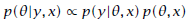
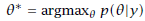

## 1. Overview
このドキュメントは統計モデリング言語であるStanのユーザーガイド，リファレンスマニュアルです．導入の章ではStanの全体像について紹介しますが，残りの章ではモデルの実際のプログラミングや，Stanのモデリング言語としての詳細な解説を，コードやデータの型も含めて，実践的な解説を行います．

### 1.1 Stan Home Page

最新のコード，例，マニュアル，バグレポート，機能追加の要望など，Stanに関する情報は下記のリンクにあるStanのホームページから参照できます．

[http://mc-stan.org](http://mc-stan.org)

### 1.2 Stanのインターフェース
Stan Projectでは３つのインターフェースをプロジェクトの一部としてサポートしています．モデリング部分やその使い方に関しては３つのインターフェースで共通していてるので，このマニュアルはその３つに共通するモデリング言語としてのマニュアルとなります．すべてのインターフェースについて初期化やサンプリング，チューニング方法について共通していて，また事後分布を分析する機能についてもおおまかに共有されています．

提供されているすべてのインターフェースについて，getting-started guideやドキュメントが完全なソースコードと共に提供されています．

#### CmdStan
CmdStanはコマンドラインからStanを利用することを可能にします．ある意味でCmdStanはStanのリファレンス実装ともいえます．もともとCmdStanのドキュメントはこのドキュメントの一部でしたが，今では独立したドキュメントとなっています．CmdStanのホームページは下記になります

[http://mc-stan.org/cmdstan.html](http://mc-stan.org/cmdstan.html)

#### RStan
RStanはRにおけるStanのインターフェースです．RStanは，R2WinBUGSとR2jagsのモデルのように外側からStanを呼び出しているというよりは，むしろRのメモリに対するインターフェースです．RStanのホームページは下記のとおりです．

[http://mc-stan.org/cmdstan.html](http://mc-stan.org/cmdstan.html)

#### PyStan
PyStanはPythonにおけるStanのインターフェースです．RStanと同様に外側のStanを呼び出すというよりは，pythonのメモリレベルのインターフェースです．PyStanのホームページは下記です．

[http://mc-stan.org/pystan.html](http://mc-stan.org/pystan.html)

#### MatlabStan
MatlabStanはMatlabにおけるStanへのインターフェースです．RstanやPyStanとは異なり,現状MatlabStanはCmdStanのラッパーです．MatlabStanのホームページは下記のとおりです．

[http://mc-stan.org/matlab-stan.html](http://mc-stan.org/matlab-stan.html)

#### Stan.jl
Stan.jlはJuliaにおけるStanのインターフェースです．これもMatlabStanと同様に，CmdStanのラッパーです．Stan.jlのホームページは以下のとおりです．

[http://mc-stan.org/julia-stan.html](http://mc-stan.org/julia-stan.html)

#### StataStan
StataStanはStataにおけるStanのインターフェースです．MatlabStan，Stan.jl と同様にこれもCmdStanのラッパーです．StataStanのホームページは下記になります．

[http://mc-stan.org/stata-stan.html](http://mc-stan.org/stata-stan.html)

### 1.3 Stanのプログラム
Stanのプログラムでは条件付き確率分布 $p(\theta \mid y, x)$ を通して統計モデルが定義されます．ここで$\theta$はモデルに組み込まれる、一連の未知の変数(例： モデルのパラメータ, 隠れ変数, 欠測データ, 将来の予測値)です。$y$はモデルに組み込まれる、一連の値が得られている変数です。$x$はモデルに組み込まれない、一連の説明変数と定数です（例：サイズ，ハイパーパラメータ）．
Stanのプログラムは，変数の型宣言と文（ステートメント）からなります．変数の型には整数，実数，ベクトル，行列はもちろん，その他の型の（多次元な）配列があり，それぞれ値を制約することもできます．変数は，その役割に応じて，`data`, `transformed data`, `parameters`, `transformed parameters`, `generated quantities`というブロックの中で宣言されます．また制約のないローカル変数を各ブロックで定義することもできます．

`transformed data`，`transformed parameters`，`generated quantities`ブロックは，そのブロックで宣言された変数を定義する文を含んでいます．特別な`model`ブロックはモデルの対数尤度を定義する文で構成されています．

また`model`ブロックの中では、Stanが内部で持っている対数確率をインクリメントするための略記として、BUGS風のサンプリング記法を利用できます．対数確率の変数には直接アクセスすることもでき、ユーザ定義の確率関数や変数変換のヤコビアンの調整を可能にします。

#### 変数の制約
変数の制約はStanにおいて，特にパラメータについて重要です．Stanが効率的にサンプリングをするためには，宣言の際に課した制約を満たすパラメータの値が、`model`ブロックにおいて台（サポート）を持つ必要があります（言い換えると，ゼロでない事後密度をもつ必要があります）．

`data`ブロックと`transformed data`ブロックにおける制約は、データの入力および変換のエラーチェックのために使われるだけです．`transformed parameters`ブロックにおける制約は，`parameters`ブロックにおける制約と同じように満たされなければなりません．さもなくばサンプリングが完全にランダムウォークになってしまうか，失敗することでしょう．`generated quantities`における制約は必ず満たされる必要があり，さもなくばサンプリングが完全に停止することでしょう．なぜなら`generated quantities`ブロックが評価される時点で抽出されたサンプルを棄却するのは遅すぎるからです。

#### 実行順序
Stanの文は手続きとして解釈されるため，順序が重要です．単一の文は変数に対する値の代入を伴います。一連の文（と必要に応じてローカル変数の定義）によりブロックが構成されます．そしてStanもまたRやBUGSで使われていた有限なfor-eachのループを提供しています．

#### 確率的プログラミング言語
Stanは手続き型の確率的プログラミング言語です．DSL（domain-specific language, ドメイン固有言語）の一種です。それは統計的な推論という特定の目的のために開発されたという意味です。

Stanは確率変数を正真正銘の第一級オブジェクトとして扱うという意味で確率的プログラミング言語です．Stanでは変数を確率変数として扱いますが，その確率変数の一部は観測されたものであり，また一部は値が未知で推定する必要がある、もしくは事後の予測推論に使う必要があるものです。観測された確率変数は`data`ブロックの中で宣言され，観測されていない変数は`parameters`ブロックで宣言されます（`parameters`ブロックで宣言された変数に依存する、`transformed parameters`ブロック内の変数・`generated quantities`ブロック内の変数・ローカル変数も含みます）。また観測されていない確率変数の周辺分布や結合分布からサンプリングすることもできますし、確率変数の平均や分散を推定することもできますし、下流の事後の予測推論のためにそれらの値をプラグインすることもできます。

StanはCやFortranと同様（C++，R，PythonやJavaなども同じ）の手続き型プログラミング言語です．代入，ループ，条件分岐，ローカル変数，オブジェクトレベルの関数や配列のようなデータ構造に基づいているからです。関数型言語と比較すれば，典型的には関数型言語では高階関数（汎関数）が許可され，しばしばリフレクション（プログラムの中でそのプログラムに含まれる型や変数/メソッドの情報を参照/操作できるようにする仕組み）が許可されています。一方で純粋な関数型言語では代入が全く許可されていません．またオブジェクト指向言語はより一般的なデータ型を取り入れており、動的に関数などが選ばれて実行されます。

Stan言語は，CやRがそうであるのと同様に，チャーチ＝チューリング完全 [Church (1936); Turing (1936); Hopcroft and Motwani (2006)]です．それはチューリングマシン（もしくはC）で計算可能ないかなるプログラムもStanで実装できることを意味しています（もちろんその道は険しいですが）．ちなみにチューリング完全であるために求められるのはただ，ループと条件分岐，そしてループの中でサイズが変更できる配列，それで全てです．

### 1.4 コンパイルとStanプログラムの実行
Stanのコードはまず最初にStanのコンパイラ`stanc`によってC++の言語へと変換され，そしてそのC++はプラットフォーム依存の単独で実行可能な形式に変換されます．またStanはWindows，Mac OS X，Linuxなど様々な実行可能形式を出力することができます．^[RやPythonなどの高レベルなスクリプト言語から使うために、Stanのプログラムは動的に接続可能なオブジェクトファイルに変換されます。]
Stanの実行ファイルを実行すると，まず既知の $y$ と $x$ を評価し，その妥当性を評価します．そして（独立ではない）同一分布に従うサンプルの列 $\theta^{(1)},\theta^{(2)},\dots$ を生成します。その各々は周辺分布 $p(\theta  \mid  y, x)$ に従います．

### 1.5 サンプリング
連続値をとるパラメータに対してStanは Hamiltonian Monte Carlo (HMC) Sampling (Du- ane et al., 1987; Neal, 1994, 2011) というある種のマルコフ連鎖モンテカルロ（MCMC）サンプリング(Metropolis et al., 1953)を用います．Stanは離散値をとるパラメータのサンプリングは提供していません．観測値としては離散値を直接利用することができますが，離散値をとるパラメータはモデルの外側で周辺化されている必要があります．10章と12章では，いかにして有限の離散値をとるパラメータをモデルから和をとって消去するか、そしてその消去がもたらすサンプリング効率の大幅な向上について議論します。

HMCは対数確率関数の勾配を使うことで、定常分布への収束とパラメタの探索の効率化を促進しています．推定すべき量のベクトル$\theta$は仮想的な粒子の位置に変換されます．それぞれのiterationにおいて、ランダムな運動量を生成し，（負の）対数確率関数を決めているポテンシャルエネルギー内の粒子の経路をシミュレーションします。ハミルトンの分解からこのポテンシャルの勾配が運動量の変化を与え，この運動量が位置の変化を与えることが分かります．この時間的に連続な変化は，時間をシミュレーションが容易な離散値とみなすleapfrogアルゴリズムによって近似されます．様々なシミュレーションエラーを直すために，マルコフ連鎖の遷移において詳細釣り合い条件を満たすようにするために，メトロポリス法の棄却ステップは逐次適用されます (Metropolis et al., 1953; Hastings, 1970)．

基本的なユークリッド空間上のHamiltonian Monte Carlo法には，振る舞いに対して大きな影響を与える3つの「チューニングすべき」パラメータがあります．Stanのサンプラーはそれらを手動で設定する方法と，ユーザを介さずに自動で設定する方法の両方を提供しています．

1つ目のチューニングパラメータはステップサイズで，ハミルトニアンの一時的な単位（すなわち，離散化の単位）において測定されたサイズです。Stanではユーザが指定したステップサイズに設定することもできますが，双対平均化法(Nesterov, 2009; Hoffman and Gelman, 2011, 2014)によってwarmupの段階で最適なステップサイズを推定することができます．どちらの場合もとり得るステップサイズの区間からステップサイズを抽出するために，追加のランダム化が適用されます(Neal, 2011)。

2つ目のチューニングパラメータはiterationごとのステップ数で，このステップ数と先ほどのステップサイズの積により全体のHamiltonianシミュレーションにかかる時間が決定します．Stanはこのステップ数も特定のステップ数を指定することができますが，No-U-Turn (NUTS) sampler (Hoffman and Gelman, 2011, 2014)を使うと、このステップ数をサンプリング中に自動的に決定することができます．

3つ目のチューニングパラメータは仮想粒子の質量行列です．Stanはwarmupの間に対角行列となる質量行列や完全な質量行列を推定するように設定できます。また、将来的にはユーザが指定した質量行列をサポートする予定です．対角行列となる質量行列を推定すると，未知のパラメータの列$\theta$の成分$\theta_k$のスケールは正規化されます．一方、完全な質量行列を推定すると、スケーリングと回転の両方を考慮することができますが，^[これらの推定された質量行列は大域的です。サンプリングされるパラメータ空間の全ての点に同じ質量行列が適用されるという意味です．Riemann-manifold HMCではこれが一般化され、質量行列によって示唆される曲率が位置ごとに変化することが許されます。]行列演算のためにleapfrogの各ステップにおいて、より多くのメモリと計算を要します。

#### 収束のモニタリングと有効サンプルサイズ
マルコフ連鎖から得られるサンプルは，その連鎖が定常分布に収束したあとに，周辺分布 $p(\theta \mid  y, x)$ から抽出されます．MCMCが収束したかどうかを判定する方法は複数ありますが，不幸にもそのうちのいずれもテストをパスしたからといって収束を保証しません．Stanにおいておすすめの方法は，いくつか異なるパラメータの初期値を用いてランダムに初期化した複数のマルコフ連鎖を走らせること，warmup/adaptationの期間のサンプルを捨てること，各チェーンの残りのサンプルを半分に分割して潜在的なスケールの逓減に関する統計量 $\hat{R}$ (Gelman and Rubin, 1992)を計算することです．もしその結果，十分なサイズの有効サンプルが得られなければ，iterationの数を2倍にして再びやり直します．warmupなど全て含めてやり直しです．^[十分に有効サンプルが得られないことは，warmupの期間の長さが不十分であることがしばしば原因です．この再実行戦略は、最初に正しいiteration数を推測するよりも、高々約50%多いiterationを消費するだけです。]

$M$ 個の独立に抽出されたサンプルに基づいて母平均を推定する場合，その推定誤差は $\frac{1}{\sqrt{M}}$ に比例します．もしMCMCを使って抽出されたサンプルのように典型的にサンプル間に正の相関があれば、その推定誤差は $\frac{1}{\sqrt{\text{N\_EFF}}}$ に比例します．ここで$\text{N\_EFF}$ は有効サンプルサイズです．したがって，目下の推定や推論のタスクに対し十分な大きさになるまで，有効サンプルサイズ（やその推定値）をモニターするのは標準的な習慣です．

#### ベイズ推定とモンテカルロ法
Stanはフルベイズの推定をサポートするために開発されました．ベイズ推定は下記の正規化されていないベイズ則

に基づいています．これはパラメータ $\theta$ と与えられたデータ $y$ (それと定数 $x$ )の事後分布 $p(\theta  \mid  y, x)$ が尤度 $p(y  \mid  \theta, x)$ と事前分布 $p(\theta, x)$ の積に比例することを表します．

Stanでは、ベイズモデリングすることは定係数を除いて事後確率関数をコーディングすることを伴います。ベイズ則から事後確率分布は定係数を除いて尤度関数と事前確率の積と等価です。

フルベイズ推定では、事後分布$p(\theta|y, x)$によるモデル化において、パラメータ$\theta$の値に関する不確実性が含まれ伝搬されてゆくことになります。このことは、事後分布からの一連のサンプルについて推定を行うことで実現できます。その際には、事後平均や事後区間等を関心のある量のためにプラグイン推定値として利用したり、事後分布に基づいて事象の結果や未観測のデータ値を予測したりします。

### 1.6 最適化
Stanは最適化に基づく推論もサポートしています．与えられた事後分布 $p(\theta \mid y)$ に対して、Stanは以下で定義される事後分布の最頻値 $\theta^\ast$ を見つけることができます．

ここで $\text{argmax}_v f(v)$ という記法は 関数 $f(v)$ を最大化する $v$ の値を選ぶことを意味します．

もし事前分布が一様分布ならば，事後分布の最頻値は，パラメータの最尤推定値（maximum likelifood estimate，MLE）に対応します．また，事前分布が一様分布でなければ，この事後分布の最頻値はしばしばMAP（maximum a posterior）推定値と呼ばれます．

最適化においては，変数の制約に由来するいかなる変換のヤコビアンも無視されます．変数宣言時に上下限の制約を取り除いて、代わりに無効な解を許さないように`model`ブロックで棄却するようにすると、多くの最適化問題でより効率的になります。

#### 点推定値による推論

推定値$\theta^\ast$ はいわゆる「点推定値」と呼ばれています．これは事後分布を分布と言うよりむしろ一つの点として要約することを意味します．もちろん点推定値それ自体は推定のばらつきを考慮しません．事後予測確率$p(\hat{y} \mid  y)$はデータ $y$ が与えられた場合の事後最頻値$p(\tilde{y} | \theta^\ast)$ を使って作ることもできます。しかし、これらは事後確率に不確実性を考慮しないため，たとえ事前分布を持っていたとしてもベイズ推定ではありません．もし，事後分布の分散が小さく、その平均が最頻値に近ければ，点推定の結果はフルベイズの推定結果と非常に近くなります．

### 1.7 変分推論
Stanはベイズ推定を近似する変分推論もサポートしています(Jordan et al., 1999; Wainwright and Jordan, 2008)．変分推論では近似した事後分布を用いて，事後分布の平均値と不確実性を推定することができます。パラメトリックな分布が真の事後分布にあてはまるように最適化し、近似した事後分布を求めます。変分推論は，特に機械学習の分野においてベイズ推定の計算にすさまじい影響を与えてきました．典型的には変分推論は従来のサンプリングによる推定に比べて速く，巨大なデータにスケールしやすいという特徴があります(Hoffman et al., 2013)。

変分推論は事後分布 $p(\theta  \mid  y)$ をシンプルなパラメトリックな分布 $q(\theta  \mid  \phi)$ で近似します．このことは真の事後分布との以下で与えられるKullback-Leibler情報量を最小化することに対応します．

![$$\phi^\ast = \text{argmin}_\phi \text{KL}[q(\theta \mid \phi) \Vert p(\theta  \mid  y)]$$](fig/fig3.png)

これはベイズ推定の問題を、解がwell-definedな計量をもつ最適化問題に帰着できることを意味します．変分推論では，サンプリングに比べてオーダーが異なるほど収束が速いです．近似の精度はモデルによって異なります．変分推論が点推定のテクニックではないことに注意すると，結果は事後分布を近似した分布だということができます．

Stanでは自動微分変分推論（Automatic Differentiation Variational Inference，ADVI）というアルゴリズムが実装されています。このアルゴリズムはStanの変数変換ライブラリや自動微分に関するツールボックスを活用するようにデザインされています(Kucukelbir et al., 2015)。ADVIは変分推論のアルゴリズムを導出するのに典型的に必要となるすべての数学を回避し，いかなるStanのモデルにおいても動作します．
