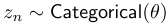
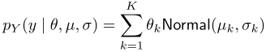
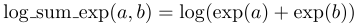
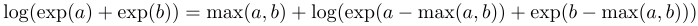
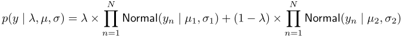
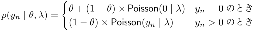
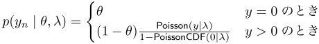
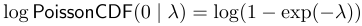

## 10. 有限混合分布

結果が有限混合分布となるモデルは、結果が複数の分布から抽出され、どの分布から抽出されるかはカテゴリカルに混合される分布により制御されると仮定します。混合モデルは通常、多峰の分布となり、その山は混合成分の最頻値に近くなります。混合分布モデルはいくつかの方法でパラメータ化できます。以下の節でそれを記述します。

### 10.1. 潜在離散値のパラメータ化

混合分布モデルをパラメータ化する方法の1つは、結果を負担する混合成分を示す潜在カテゴリカル変数を使うことです。例えば、$K$個の正規分布があり、その位置は$\mu_{k} \in \mathcal{R}$、スケールは$\sigma_{k} \in (0, \infty)$とします。ここで、これらを割合$\theta$で混合させるとします。$\theta_{k} \ge 0$かつ$\sum_{k=1}^{K}\theta_{k}=1$、すなわち$\theta$は$K$次元単体です。各結果$y_{n}$には潜在変数$z_{n} \in {1,\dots,K}$があり、これは$\theta$によりパラメータ化されるカテゴリカル分布に従うとします。



変数$y_{n}$は、混合成分$z_{n}$のパラメータに従って分布します。

![$$y_{n} \sim \mathsf{Normal}(\mu_{z[n]},\sigma_{z[n]})$$](fig/fig02.png)

離散パラメータ$z_{n}$があるので、Stanではこのモデルは直接扱うことができませんが、次の節で記述するように$z$パラメータを総和で消去することにより$\mu$と$\sigma$をサンプリングできます。

### 10.2. 負担率パラメータを総和で消去

前の節でざっと見た正規混合モデルをStanで実装するため、総和により離散パラメータをモデルから消去することができます。$Y$が$K$個の正規分布の混合分布で、正規分布のが位置$\mu_{k}$、スケール$\sigma_{k}$、$K$次元単位単体に従う割合$\theta$で混合される場合は、次式のように表されます。



### 10.3. 指数の和の対数: 対数スケールでの線形の和

指数の和の対数関数は、対数スケールの混合を定義するのに使われます。2つの入力値の場合は以下のように定義されます。



$a$と$b$が対数スケールの確率なら、$\exp(a)+\exp(b)$は線形スケールでの両者の和になります。そして外側の対数で、結果を対数スケールに戻します。まとめると、log\sum\_expは対数スケールで線形の加算を行なうということになります。Stanの組込み`log_sum_exp`関数を使う理由は、指数計算でのアンダーフローやオーバーフローを防ぐことができるということにあります。結果は以下のように計算されます。


（**訳注:原文ではlog()の中の'+'が','になっています。**）

この式の評価では、$a-\max(a,b)$か$b-\max(a,b)$のいずれかが0になり、他方は負になります。これにより、主項でオーバーフローやアンダーフローが発生する可能性をなくし、演算での算術精度を可能な限り確保します。

例として、$\mathsf{Normal}(-1, 2)$と$\mathsf{Normal}(3, 1)$とが確率$\theta=(0.3,0.7)^{T}$で混ざる混合分布は、Stanでは以下のように実装できます。

```
parameters {
  real y;
}
model {
  increment_log_prob(log_sum_exp(log(0.3)
                                   + normal_log(y,-1,2),
                                 log(0.7)
                                   + normal_log(y,3,1)));
}
```

対数確率の項は以下のように導出されます。


#### 混合パラメータの推定

混合分布を表現する枠組みが与えられたところで、設定の推定に移りましょう。ここでは、位置、スケール、混合成分が未知の量です。さらに、混合成分の数も一般化してデータとして指定したものが以下のモデルになります。

```
data {
  int<lower=1> K;          // 混合成分の数
  int<lower=1> N;          // データ点の数
  real y[N];               // 観測値
}
parameters {
  simplex[K] theta;        // 混合確率
  real mu[K];              // 混合成分の位置
  real<lower=0> sigma[K];  // 混合成分のスケール
} model {
  real ps[K];              // 成分密度の対数の一時変数
  sigma ~ cauchy(0,2.5);
  mu ~ normal(0,10);
  for (n in 1:N) {
    for (k in 1:K) {
      ps[k] <- log(theta[k])
               + normal_log(y[n],mu[k],sigma[k]);
    }
    increment_log_prob(log_sum_exp(ps));
  }
}
```

このモデルには、$K$個の混合成分と$N$個のデータ点があります。混合割合のパラメータ`theta`は$K$次元単位単体として宣言されており、成分の位置パラメータ`mu`とスケールパラメータ`sigma`はともに大きさ`K`の配列として定義されています。スケールの配列`sigma`の値は非負に制約されており、このモデルでは弱情報事前分布を与えています。モデル中で、大きさ`K`の局所配列変数`ps`が宣言されており、混合成分からの寄与を積算するのに使われています。

これは例題なので、位置とスケールは単純な事前分布から抽出されていますが、Stanでサポートされることが何でもできるでしょう。混合成分は階層的にモデリングすることさえ可能でしょう。

作業の中心は、データ点`n`についてのループ中にあります。各点について、$\theta_{k}\times\mathsf{Normal}(y_{n}\mid\mu_{k},\sigma_{k})$の対数が計算され、配列`ps`に加算されます。それから、その値の指数の和の対数だけ対数確率を増加させます。

### 10.4. 混合分布のベクトル化

Stanでは（今のところ）混合分布モデルを観測値のレベルでベクトル化する方法はありません。この節は読者に注意を行なうものですが、単純にベクトル化しようとしてはいけません。そのようにすると、結果として別のモデルとなってしまいます。観測値のレベルでの正しい混合は以下のように定義されます。

```
for (n in 1:N)
  increment_log_prob(log(lambda)
                       + normal_log(y[n], mu[1], sigma[1]),
                     log1m(lambda)
                       + normal_log(y[n], mu[2], sigma[2]));
```

下も等価です。

```
for (n in 1:N)
  increment_log_prob(log_mix(lambda,
                             normal_log(y[n], mu[1], sigma[1]),
                             normal_log(y[n], mu[2], sigma[2])));
```

この定義では、各観測値$y_{n}$が混合成分のいずれかから得られると仮定しています。以下のように定義されます。


上のモデルと、下の（間違った）モデルのベクトル化の試みを対比してみてください。

```
increment_log_prob(log(lambda)
                     + normal_log(y, mu[1], sigma[1]),
                   log1m(lambda)
                     + normal_log(y, mu[2], sigma[2]));
```

下も等価です。

```
increment_log_prob(log_mix(lambda,
                           normal_log(y, mu[1], sigma[1]),
                           normal_log(y, mu[2], sigma[2])));
```

この2番目の定義は、観測値の系列$y_{1},\dots,y_{n}$全体が一方の成分か、他方の成分かから得られていることを意味します。別の密度を定義しているのです。




### 10.5. ゼロ過剰モデルとハードルモデル

ゼロ過剰モデルとハードルモデルはともに、ポアソン分布と、ベルヌーイ確率質量関数との混合分布で、零値の結果の確率をより柔軟にモデリングできます。ゼロ過剰モデルは、Lambert (1992)により定義されたもので、零値の結果に対して追加の確率質量を与えるものです。一方、ハードルモデルは零値と非零値の結果の純粋な混合分布として定式化されます。

ゼロ過剰モデルとハードルモデルは、ポアソン分布以外の離散分布についても定式化できます。ゼロ過剰はStanでは連続分布でうまくいきません。これは、導関数の問題によるもので、特に、回帰係数の事前分布として正規分布をゼロ過剰にするようなときに、連続分布に対して点の質量を加算する方法がありません。

#### ゼロ過剰

以下のゼロ過剰ポアソン分布の例について考えます。ここではパラメータ`theta`を使って、確率$\theta$で0が抽出され、確率$1-\theta$で$\mathsf{Poisson}(\lambda)$から抽出されるとしています。確率関数は以下のとおりです。



対数確率関数はStanでは以下のようにそのまま実装できます。

```
data {
  int<lower=0> N;
  int<lower=0> y[N];
}
parameters {
  real<lower=0,upper=1> theta;
  real lambda;
}
model {
  for (n in 1:N) {
    if (y[n] == 0)
      increment_log_prob(log_sum_exp(bernoulli_log(1,theta),
                                     bernoulli_log(0,theta)
                                     + poisson_log(y[n],lambda)));
    else
      increment_log_prob(bernoulli_log(0,theta)
                         + poisson_log(y[n],lambda));
  }
}
```

`log_sum_exp(lp1,lp2`関数は対数確率を線形スケールで加算します。`log(exp(lp1) + exp(lp2))`と同じですが、より算術的に安定し、高速です。

`increment_log_prob`関数の内部で`if_else`構文を使うようにしたいと思うかもしれませんが、`if_else_(c,e1,e2)`は`c`の値に関わらず`e1`と`e2`の両方を評価するので、これはおすすめできません。

#### ハードルモデル

ハードルモデルはゼロ過剰モデルに似ていますが、もっと柔軟で、零値の結果が過剰のときのみならず少なすぎるときも扱うことができます。ハードルモデルの確率質量関数は以下のように定義されます。



ここで$\mathsf{PoissonCDF}$は、ポアソン分布の累積分布関数です。ハードルモデルはStanではさらに直接的にプログラミングできます。明示的な混合も必要ありません。

```
(y[n] == 0) ~ bernoulli(theta);
if (y[n] > 0)
  y[n] ~ poisson(lambda) T[1,];
```

ポアソン分布のあとの`[1,]`は1未満の値が切断されることを示しています。これについては40.5節を参照してください。変数`y[n]`が2回「サンプリング」されていますが、対数確率関数への効果は（対数スケールでの）定義に従っています。

Julian Kingは、以下のように記述するとモデルが高速化するかもしれないと指摘しました。



こうすると、切断ポアソン分布は以下のようにコーディングされます。

```
if (y[n] > 0) {
  y[n] ~ poisson(lambda);
  increment_log_prob(-log1m_exp(-lambda));
}
```

前もって計数値をまとめておくことにより（**collecting counts ahead of time**）、密度を変えることなく実行速度をおおいに高速化することもできるという1例を示します。例えば、`y[n] == 0`の場合の数を数え、変換データ量として格納しておきます。これは、

```
model {
  ...
  for (n in 1:N)
    (y[n] == 0) ~ bernoulli(theta);
```

を

```
transformed data {
  int N_zero;
  N_zero <- 0;
  for (n in 1:N)
    if (y[n] == 0)
      N_zero <- N_zero + 1;
}
model {
  ...
  N_zero ~ binomial(N, theta);
```

と、変えればできます。

また別の高速化の方法として、計数値が非零（すなわち`y[n] > 0`）の場合に、その数を新しく定義した配列に格納し、それからベクトル化したポアソン分布のサンプリング文を使って、非零の計数値の数を増加分に掛けるというものがあります。これはややトリッキーです。Stanでは宣言の時に大きさが必要ですので、ここでは零と非零の場合の数を計算する関数を使う必要があります。