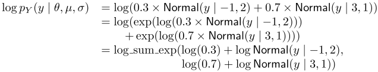

## 10. 有限混合分布

### 10.1. 潜在離散値のパラメータ化


![$$y_{n} \sim \mathsf{Normal}(\mu_{z[n]},\sigma_{z[n]})$$](fig/fig02.png)

### 10.2. 負担率パラメータを総和で消去


### 10.3. 指数の和の対数: 対数スケールでの線形の和


```
parameters {
  real y;
}
model {
  increment_log_prob(log_sum_exp(log(0.3)
                                   + normal_log(y,-1,2),
                                 log(0.7)
                                   + normal_log(y,3,1)));
}
```

#### 混合パラメータの推定


```
data {
  int<lower=1> K;          // number of mixture components
  int<lower=1> N;          // number of data points
  real y[N];               // observations
}
parameters {
  simplex[K] theta;        // mixing proportions
  real mu[K];              // locations of mixture components
  real<lower=0> sigma[K];  // scales of mixture components
} model {
  real ps[K];              // temp for log component densities
  sigma ~ cauchy(0,2.5);
  mu ~ normal(0,10);
  for (n in 1:N) {
    for (k in 1:K) {
      ps[k] <- log(theta[k])
               + normal_log(y[n],mu[k],sigma[k]);
    }
    increment_log_prob(log_sum_exp(ps));
  }
}
```


### 10.4. 混合分布のベクトル化


```
for (n in 1:N)
  increment_log_prob(log(lambda)
                       + normal_log(y[n], mu[1], sigma[1]),
                     log1m(lambda)
                       + normal_log(y[n], mu[2], sigma[2]));
```


```
for (n in 1:N)
  increment_log_prob(log_mix(lambda,
                             normal_log(y[n], mu[1], sigma[1]),
                             normal_log(y[n], mu[2], sigma[2])));
```




```
increment_log_prob(log(lambda)
                     + normal_log(y, mu[1], sigma[1]),
                   log1m(lambda)
                     + normal_log(y, mu[2], sigma[2]));
```


```
increment_log_prob(log_mix(lambda,
                           normal_log(y, mu[1], sigma[1]),
                           normal_log(y, mu[2], sigma[2])));
```


### 10.5. ゼロ過剰モデルとハードルモデル


#### ゼロ過剰


```
data {
  int<lower=0> N;
  int<lower=0> y[N];
}
parameters {
  real<lower=0,upper=1> theta;
  real lambda;
}
model {
  for (n in 1:N) {
    if (y[n] == 0)
      increment_log_prob(log_sum_exp(bernoulli_log(1,theta),
                                     bernoulli_log(0,theta)
                                     + poisson_log(y[n],lambda)));
    else
      increment_log_prob(bernoulli_log(0,theta)
                         + poisson_log(y[n],lambda));
  }
}
```


#### ハードルモデル


```
(y[n] == 0) ~ bernoulli(theta);
if (y[n] > 0)
  y[n] ~ poisson(lambda) T[1,];
```


```
if (y[n] > 0) {
  y[n] ~ poisson(lambda);
  increment_log_prob(-log1m_exp(-lambda));
}
```

```
model {
  ...
  for (n in 1:N)
    (y[n] == 0) ~ bernoulli(theta);
```


```
transformed data {
  int N_zero;
  N_zero <- 0;
  for (n in 1:N)
    if (y[n] == 0)
      N_zero <- N_zero + 1;
}
model {
  ...
  N_zero ~ binomial(N, theta);
```
