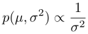
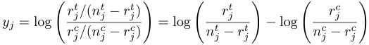
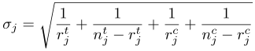

## 11. 測定誤差とメタアナリシス

統計モデルで使われる量のほとんどは測定で得られたものです。こうした測定にはほとんどの場合、何らかの誤差があるものです。測定された量に対して測定誤差が小さいときには、モデルへの影響は小さいのが普通です。測定された量に対して測定誤差が大きいときや、非常に精密な関係を、測定された量に推定する可能性があるときは、測定誤差を明示的に取り入れたモデルが役に立ちます。丸め誤差も測定誤差の一種です。

メタアナリシスは統計的には、測定誤差モデルと非常によく似ています。メタアナリシスでは、複数のデータセットから導かれた推定が、そのすべてについての推定にまとめられます。各データセットについての推定は、真のパラメータの値に対して、ある種の測定誤差があるものとして扱われます。

### 11.1. ベイズ測定誤差モデル

ベイズ統計の手法では、真の量を欠測データとして扱うことにより、測定誤差を直接的に定式化できます(Clayton, 1992; Richardson and Gilks, 1993)。これには、真の値から測定値がどのように導かれるのかというモデルが必要です。

#### 測定誤差のある回帰

測定誤差のある回帰を考える前にまず、予測変数$x_n$と結果変数$y_n$がある$N$回の観測データの線形回帰モデルを考えましょう。Stanでは、傾きと切片のある、$x$についての$y$の線形回帰は以下のようにモデリングされます。

```
data {
  int<lower=0> N;       // 観測回数
  real x[N];            // 予測変数（共変量）
  real y[N];            // 結果変数（変量）
}
parameters {
  real alpha;           // 切片
  real beta;            // 傾き
  real<lower=0> sigma;  // 結果変数のノイズ
} model {
  y ~ normal(alpha + beta * x, sigma);
  alpha ~ normal(0,10);
  beta ~ normal(0,10);
  sigma ~ cauchy(0,5);
}
```

ここで、予測変数$x_n$の真値が既知ではないとします。ただし、各$n$について、$x_n$の測定値$x_{n}^\mathrm{meas}$は分かっています。測定誤差をモデリングできるならば、測定値$x_{n}^\mathrm{meas}$は、真値$x_n$に測定ノイズを加算したものとモデリングできます。非常に単純な方法としては、測定誤差が既知の偏差$\tau$で正規分布すると仮定する方法があります。以下のような、測定誤差が一定の回帰モデルになります。

```
data {
  ...
  real x_meas[N];     // xの測定値
  real<lower=0> tau;  // 測定ノイズ
}
parameters {
  real x[N];          // 未知の真値
  real mu_x;          // 事前分布の位置
  real sigma_x;       // 事前分布のスケール
  ...
}
model {
  x ~ normal(mu_x, sigma_x);   // 事前分布
  x_meas ~ normal(x, tau);   // 測定モデル
  y ~ normal(alpha + beta * x, sigma);
  ...
}
```

回帰係数の`alpha`と`beta`、回帰ノイズのスケール`sigma`は前と同じですが、データではなくパラメータとして`x`が新たに宣言されています。データは`x\_meas`になり、真の`x`の値からスケール`tau`のノイズを含めて測定されているとなっています。さらに真値`x`にはここでは階層事前分布が与えられています。

測定誤差が正規分布でない場合には、もっと複雑な測定誤差モデルを指定することもできます。真値の事前分布も複雑にできます。例えば、Clayton (1992)は、既知の（測定誤差のない）リスク要因$c$に対する、未知の（ただしノイズ込みで測定された）リスク要因$x$についての暴露モデルを紹介しています。単純なモデルでは、共変量$c_n$とノイズ項$\upsilon$から$x_n$を回帰するというようになるでしょう。


これはStanでは、ほかの回帰とまったく同様にコーディングできます。もちろん、さらにほかの暴露モデルも使えます。

#### 丸め

測定誤差でよくあるのは、測定値を丸めることに由来するものです。丸めのやり方はたくさんあります。重さをもっとも近いミリグラムの値に丸めたり、もっとも近いポンドの値に丸めたりします。もっとも近い整数に切り下げるという丸めもあります。

Gelman et al. (2013)の演習3.5(b)に以下の例題があります。

> 3.5 ある物体の重さを5回はかるとします。測定値はもっとも近いポンドの値に丸められ、10, 10, 12, 11, 9となりました。丸める前の測定値は正規分布するとして、$\mu$と$\sigma^2$には無情報事前分布を使います。
> (b) 測定値が丸められていることを考慮して、$(\mu, \sigma^2)$についての正しい事後分布を求めなさい。





```
data {
  int<lower=0> N;
  vector[N] y;
}
parameters {
  real mu;
  real<lower=0> sigma_sq;
}
transformed parameters {
  real<lower=0> sigma;
  sigma <- sqrt(sigma_sq);
}
model {
  increment_log_prob(-2 * log(sigma));
  for (n in 1:N)
    increment_log_prob(log(Phi((y[n] + 0.5 - mu) / sigma)
                           - Phi((y[n] - 0.5 - mu) / sigma)));
}
```


```
data {
  int<lower=0> N;
  vector[N] y;
}
parameters {
  real mu;
  real<lower=0> sigma_sq;
  vector<lower=-0.5, upper=0.5>[5] y_err;
}
transformed parameters {
  real<lower=0> sigma;
  vector[N] z;
  sigma <- sqrt(sigma_sq);
  z <- y + y_err;
}
model {
  increment_log_prob(-2 * log(sigma));
  z ~ normal(mu, sigma);
}
```


### 11.2. メタアナリシス


#### 統制研究における処置の効果


##### データ


```
data {
  int<lower=0> J;
  int<lower=0> n_t[J];  // num cases, treatment
  int<lower=0> r_t[J];  // num successes, treatment
  int<lower=0> n_c[J];  // num cases, control
  int<lower=0> r_c[J];  // num successes, control
}
```

##### 対数オッズへの変換と標準誤差







```
transformed data {
  real y[J];
  real<lower=0> sigma[J];
  for (j in 1:J)
    y[j] <- log(r_t[j]) - log(n_t[j] - r_t[j])
            - (log(r_c[j]) - log(n_c[j] - r_c[j]);
  for (j in 1:J)
    sigma[j] <- sqrt(1.0/r_t[i] + 1.0/(n_t[i] - r_t[i])
                     + 1.0/r_c[i] + 1.0/(n_c[i] - r_c[i]));
}
```


##### 非階層モデル


```
parameters {
  real theta;  // global treatment effect, log odds
}
model {
  y ~ normal(theta,sigma);
}
```


```
for (j in 1:J)
  y[j] ~ normal(theta,sigma[j]);
```


##### 階層モデル


##### 拡張と代替法


