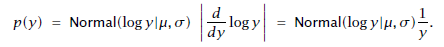

## 17. 再パラメータ化と変数変換
BUGSと同様に、Stanでは直接的な再パラメータ化がサポートされています。また、Stanでは変数変換もサポートされており、変数変換のヤコビアンの対数を対数確率の合計に直接加えることで実現します。

### 17.1. 理論的かつ実践的な背景
ベイズの事後分布は専門的には確率「測度」であり、それはパラメータ化によって不変な、抽象数学のものです。^[対照的に（罰則付き）最尤推定は、パラメータ化によって不変ではありません。]他方、Stanのモデリング言語は確率「密度」を定義します。確率密度は$\mathcal{R}^N$から$\mathcal{R}^+$に写す関数であり、ユニークではなく、パラメータ化に依存します。実際には、これは与えられたモデルをStanで表現する方法は複数あり得ることを意味し、表現が異なれば計算のパフォーマンスも異なることを意味します。

パラメータ化とベイズモデリングの関係を議論したGelman (2004)で指摘されたように、パラメータ化を変えるとどのようにモデルが変わるかに関する示唆が得られる場合がしばしばあります。私たちは特定の自然なクラスの事前分布を多用する傾向があります。それゆえ、再パラメータ化の恩恵は、サンプリングをしたいと決めた分布に対する計算の助け「だけ」にはとどまらないのです。さらに、いったん再パラメータ化をして事前情報を加えると、モデル自体も典型的には変わりますし、しばしば有益な方向に変わります。^[Gelmanの便利な統計用語集（<http://andrewgelman.com/2009/05/24/handy_statistic/>）ではピノキオの原則に言及しています。この原則は「計算上の理由だけで作られたモデルにも魂が宿り、ひとり歩きする可能性がある」というものです。この原則はGelmanがフォーク定理と呼んでいる経験則にも関係があります。その定理は「計算がうまくいかないときは、しばしばあなたのモデルに問題がある」というものです。]


### 17.2. 再パラメータ化
再パラメータ化は素直に実装できます。例えば、ベータ分布は2つの正のカウントを表すパラメータ$\alpha, \beta > 0$によってパラメータ化されています。次の例は、`vector`型のパラメータ`theta`を持つ階層的なStanのモデルを表しています。ここで、`theta`は独立同一なベータ分布から抽出されており、ベータ分布のパラメータは超事前分布から抽出されます。

```
parameters {
  real<lower = 0> alpha;
  real<lower = 0> beta;
  ...
model {
  alpha ~ ...
  beta ~ ...
  for (n in 1:N)
    theta[n] ~ beta(alpha, beta);
  ...
```

変換パラメータ（transformed parameter）を使って超事前分布を定めた方がしばしばより自然です。ベータ分布の場合、明らかな再パラメータ化のやり方は平均パラメータ


とカウントの合計を表すパラメータ


を使う方法です。(Gelman et al., 2013, Chapter 5)に従うと、平均パラメータの事前分布に一様分布を設定し、カウントの合計を表すパラメータの事前分布に$p(\lambda) \propto \lambda^{-2.5}$のパレート分布を設定します。

```
parameters {
  real<lower=0,upper=1> phi;
  real<lower=0.1> lambda;
  ...
  transformed parameters {
  real<lower=0> alpha;
  real<lower=0> beta;
  ...
  alpha = lambda * phi;
  beta = lambda * (1 - phi);
  ...
model {
  phi ~ beta(1, 1); // phiは一様分布に従う. この行は省略してもよい.
  lambda ~ pareto(0.1, 1.5);
  for (n in 1:N)
    theta[n] ~ beta(alpha, beta);
  ...
```

新しいパラメータ`phi`と`lambda`は`parameters`ブロックで宣言され、ベータ分布のパラメータである`alpha`と`beta`は`transformed parameters`ブロックで宣言されて定義されます。もし、`alpha`と`beta`の値に興味がなければ、代わりに`model`ブロックで局所変数として定義することもできます。次のようになります。

```
model {
  real alpha;
  real beta;
  alpha = lambda * phi;
  beta = lambda * (1 - phi);
  ...
  for (n in 1:N)
    theta[n] ~ beta(alpha, beta);
  ...
}
```

ベクトル化すると、次のようにもっとコンパクトで効率的に表現できます。

```
model {
  theta ~ beta(lambda * phi, lambda * (1 - phi));
  ...
}
```

もし、`alpha`と`beta`の値に興味があるならば、これらを`transformed parameters`ブロックで定義してから`model`ブロックで使うとよいでしょう。

#### ヤコビアンは必要ない
分布を与えるのではなく、変換パラメータ（transformed parameter）を使う場合は、変換に対するヤコビアンの調整は不要です。例えば、ベータ分布の例では`alpha`と`beta`は適切な事後分布を持ちます。


### 17.3. 変数変換
パラメータの変換が確率分布によって特徴づけられるときに、確率の調整が必要な「変数変換」となります。標準的な教科書の例は対数正規分布です。確率変数$y > 0$の分布が対数正規分布に従うとき、$y$の対数である$\log y$は正規分布に従います。分布が$\log y$に割り当てられている点に注意です。

変数変換は変換によるゆがみを考慮に入れるため、確率の調整が必要となります。この調整がうまくいくためには、一変量の変数変換が台（support）において単調かつ至るところで微分可能でなければなりません。

一変量の変数変換では、変換の微分の絶対値を使って確率をスケーリングする必要があります（一変量の変数変換のより正確な定義については58.1節を見てください）。

対数正規分布の場合、$y$の対数が平均$\mu$・標準偏差$\sigma$の正規分布に従うとすると、$y$の分布は以下で与えられます。



Stanはアンダーフローを防ぐため、対数スケールで動作します。そのため、以下の形で扱います。


Stanでは変数変換はサンプリング文において適用されます。曲率を調整するために、変換の微分の絶対値の対数が対数確率の合計に足しこまれます。Stanでは対数正規分布は次のように直接的に実装できます。^[この例は説明のためのものです。Stanで対数正規分布を実装するオススメの方法はビルトインの確率分布関数`lognormal`を使うことです（45.1節を見てください）。]

```
parameters {
  real<lower=0> y;
  ...
model {
  log(y) ~ normal(mu, sigma);
  target += -log(y);
  ...
```

パラメータの宣言時に適切な制約を課すことは毎度のことながら重要です。ここで`y`は正に制限されています。

次にように、対数をとったあとの局所変数を定義すると、わずかにより効率的でしょう。

```
model {
  real log_y;
  log_y = log(y);
  log_y ~ normal(mu, sigma);
  target += -log_y;
  ...
```

もし`y`がパラメータではなくデータとして宣言されているならば、ヤコビアンによる調整は無視されます。なぜなら、データは定数であり、Stanでは定数を除いた対数確率だけが必要となるからです。


#### 変数変換 vs. 単純な変換パラメータ
この節では変数変換と単純な変換パラメータの違いを説明します。単純な変換パラメータを使う場合、パラメータをサンプリングし、そのあとでサンプリングした値を変換します。ところが変数変換の場合、パラメータを変換し、そのあとでサンプリングします。後者だけがヤコビアンの調整を必要とします。

確率関数がサンプリング文で表現されているかどうかは関係ありません。例えば、以下のようなサンプリング文で表現しても

```
log(y) ~ normal(mu, sigma);
```

以下の対数確率を累積する（インクリメントする）文で表現しても、ヤコビアンの調整が必要です。

```
target += normal_lpmf(log(y) | mu, sigma);
```

##### ガンマ分布と逆ガンマ分布
対数正規分布と同じように、逆ガンマ分布に従う変数の逆数はガンマ分布に従います。この節では二つのアプローチを比較します。はじめに単純な変換パラメータを使う場合を、次に変数変換の場合を扱います。

単純な変換パラメータを使うアプローチで`y_inv`を逆ガンマ分布からサンプリングするには、以下のようにコーディングします。

```
parameters {
  real<lower=0> y;
}
transformed parameters {
  real<lower=0> y_inv;
  y_inv = 1 / y;
}
model {
  y ~ gamma(2,4);
}
```

変数変換のアプローチで`y_inv`を逆ガンマ分布からサンプリングするには、以下のようにコーディングします。

```
parameters {
  real<lower=0> y_inv;
}
transformed parameters {
  real<lower=0> y;
  y = 1 / y_inv; // 変換
  target += -2 * log(y_inv); // 調整
}
model {
  y ~ gamma(2,4);
}
```

ヤコビアンによる調整は変換の微分の絶対値の対数です。ここでは以下のようになります。


#### 多変量の変数変換
多変量の変数変換の場合には、変換のヤコビアンの対数を対数確率の合計に足しこまなければなりません（多変量の変換とヤコビアンのより正確な定義については58.1節を見てください）。Stanでは、ヤコビアンが密行列となる一般の場合には以下のようにコーディングできます。

```
parameters {
  vector[K] u; // 多変量のパラメータ
  ...
transformed parameters {
  vector[K] v; // 変換パラメータ
  matrix[K, K] J; // 変換のヤコビ行列
  ... uの関数としてvを計算する ...
  ... J[m, n] = d.v[m] / d.u[n] を計算する ...
  target += log(fabs(determinant(J)));
  ...
model {
  v ~ ...;
  ...
```

もちろん、ヤコビアンが解析的に分かっていれば、行列式を求める関数を呼ぶよりも直接そのヤコビアンを適用した方がより効率的でしょう。行列式を求める関数は効率的でないし、数値的に安定でもありません。

多くの場合、ヤコビ行列は三角行列になるでしょう。その場合、行列式の計算には対角成分だけが必要となります。変換パラメータの`vector`のそれぞれの要素`v[k]`が、パラメータの`vector`の要素`u[1], ..., u[k]`にのみ依存する時、ヤコビ行列は三角行列となります。三角行列の行列式は対角成分の積となるので、上記のモデルの`transformed parameters`ブロックはシンプルにでき、以下のように専用の変数を使うとより効率的にできます。

```
transformed parameters {
  ...
  vector[K] J_diag; // ヤコビ行列の対角成分
  ...
  ... J_diag[k] = d.v[k] / d.u[k] を計算する ...
  target += sum(log(J_diag));
  ...
```

### 17.4. 変化する境界をもつ`vector`
Stanではコンテナの型に対する制約は、一つの下限と一つの上限しか宣言できません。しかし、ある`vector`型のパラメータの各要素の下限値が、同じように`vector`型で与えられているとしましょう。すると、要素ごとの変換とそのヤコビアン（これらは58章に記述があります）をStanで計算する必要があります。

例えば、下限を表す`vector`$L$を持つ、パラメータの`vector`$\alpha$を考えてみましょう。以下のプログラムでは制約のないraw（生の）パラメータを宣言し、それからヤコビアンを考慮してrawパラメータを明示的に$\alpha$に変換します。

```
data {
  int N;
  vector[N] L; // 下限値
  ...
parameters {
  vector[N] alpha_raw;
  ...
transformed parameters {
  vector[N] alpha;
  alpha = L + exp(alpha_raw);
  ...
model {
  target += sum(alpha_raw); // ヤコビアンの対数
  ...
```

調整項は、$\alpha_\text{raw}$から$\alpha = L + \exp(\alpha_\text{raw})$への変換に関するヤコビ行列の行列式の対数になります。この場合はヤコビ行列が対角行列になるのでシンプルになります（詳しくは58.2節をみてください）。ここで、$L$は$\alpha_\text{raw}$に依存しないパラメータを含むことすらできます。もし境界が$\alpha_\text{raw}$に依存するならば、依存性を考慮に入れてヤコビアンを計算しなおす必要があります。
