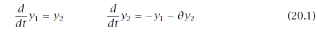
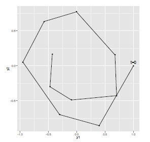

## 20. 微分方程式を解く
Stanでは常微分方程式（ordinary differential equations、略してODE）の系を解くビルトインの仕組みがあります。Stanでは2つの異なるソルバーが用意されています。1つはstiffでない系を、もう片方はstiffの系を解くためにチューニングされています。

- rk45: stiffでない系のための4-5次のルンゲクッタ法です。 (Dormand and Prince, 1980; Ahnert and Mulansky, 2011), and
- bdf: stiffな系のための、刻み幅が変動して近似の次数が変動する、後退差分公式の実装です (Cohen and Hindmarsh, 1996; Serban and Hindmarsh, 2005)

stiffな常微分方程式の系に関する議論は20.4節を見てください。短く言えば、stiffな系のソルバーは遅いけれどより頑健です。どれくらいそういう傾向があるかは、解く系やパラメータ空間の領域に依存します。StanのODEソルバーの引数と返値については38章に記載があります。


### 20.1. 例：単純な調和振動子
ODEの系の具体例として調和振動子を考えましょう。調和振動子の系は平衡状態の位置とそこからのズレに比例して戻ろうとする力（摩擦の影響を含む）で特徴づけられます。系の状態は位置と運動量を表すペアである$(y = (y_1, y_2))$で記述されます（すなわち相空間上の点になります）。時刻による系の変化は次の微分方程式で与えられます。^[この例は、Stanが`rk45`ソルバーを実装するために使ったBoost Numeric Odeint library (Ahnert and　Mulansky, 2011)のドキュメントからとってきている。]



この状態式はある与えられた時刻における系の状態を、初期状態・初期状態からの経過時間・系のパラメータの関数として暗黙のうちに定義しています。

#### 初期条件が与えられた場合の解法
系のパラメータ$(\theta)$の値と時刻$(t_0)$における初期状態$(y(t_0))$が与えられると、ある時刻の系列$(t_0 < t_1 < t_2 < \cdots)$における$(y(t))$を求めるために、数値計算で解の時間発展をシミュレーションできます。


### 20.2. 常微分方程式の系をコーディングする
Stanでは厳密に引数と返値が決められた関数によって、ODEの系は直接的にコーディングされます。例えば、(20.1)式で与えられた単純な調和振動子は、Stanでは次のようにコーディングされるでしょう（ユーザー定義関数のコーディングに関するさらなる情報は19章を見てください）。

```
real[] sho(real t,        // 時刻
           real[] y,      // 状態
           real[] theta,  // パラメータ
           real[] x_r,    // データ (`real`)
           int[] x_i) {   // データ (`integer`)
  real dydt[2];
  dydt[1] = y[2];
  dydt[2] = -y[1] - theta[1] * y[2];
  return dydt;
}
```

この系を表す関数は、時刻`t`（`real`型の値）、系の状態`y`（`real`型の配列）、系のパラメータ`theta`（`real`型の配列）、実数値のデータである変数`x_r`（`real`型の配列）、整数値のデータである変数`x_i`（`int`型の配列）を引数にとります。この関数は系の状態`y`の時間についての微分の値の配列を返します。微分の値は時刻`t`・状態`y`で評価したものです。ここでコーディングした単純な調和振動子は時間に依存する方程式ではありません。すなわち、`t`は`dtdt`の定義に現れません。単純な調和振動子は`real`型および`int`型のデータを使いません。しかし、上のコードで示した関数の引数と返値の型に厳密に一致するように、これらの使わない引数も系を表す関数の引数として宣言に含める必要があります。

#### 厳密な関数の引数と返値の型
系を定義する関数はこれらの引数と返値の方を必ず持っている必要があります。このため、系がデータやパラメータを含まない場合には、データやパラメータに0の長さの配列を渡すことになるかもしれません。データを表す変数に全く依存しない単純な調和振動子の完全な例は図20.1にあります。


#### 不連続なODEの系の関数
ODEのソルバーは状態`y`の関数に不連続点があっても積分できます。ただし、不連続点の近くの点の精度は問題になるかもしれません（多数の小さな計算ステップを要します）。そのような不連続点の例は薬物動態モデルの中のラグです。体内の薬物濃度は、あるラグ時間を$(t^{\prime})$とすると、$(0 < t < t^{\prime})$を満たす時刻`t`に対しては濃度がゼロとなる一方で、$(t \ge t^{\prime})$を満たす時刻`t`に対しては非ゼロになります。例を挙げると、コードは以下のようになるでしょう。

```
if (t < t_lag)
  return 0;
else
  ... 非ゼロの値を返す ...;
```

#### さまざまな初期時刻
StanのODEソルバーでは引数の初期時刻は定数である必要があります（すなわち、データか変換データ（transformed data）か定数の関数となっている必要があります）。これは、一般に、初期時刻をパラメータにして`integrate_ode`関数を使うことはできないことを意味します。したがって、一般に、測定値からODEの系の初期時刻を推定することはできないことを意味します。


### 20.3. 測定エラーモデル
有限の時点における、ノイズを含む系の状態の測定結果が与えられた場合に、統計モデルや微分方程式は力学系のパラメータと初期状態の両方あるいはいずれか一方を推定するために使うことができるでしょう。

例えば、単純な調和振動子において、パラメータの値が$(\theta = 0.15)$で初期状態が$(y(t=0) = (1,0))$である場合を考えましょう。今、系が10時点$(t = 1,2,\cdots,10)$において測定されたとしましょう。それぞれの時点における$(y(t))$の測定には、$(y_1(t))$と$(y_2(t))$のどちらの軸にも$(\mathsf{Normal}(0, 0.1))$に従う独立な誤差が入るとしましょう。そのような測定のプロット例を図20.1に示します。



図20.1: 単純な調和振動子において、パラメータの値が$(\theta = 0.15)$で初期状態が$(y(t=0) = (1,0))$である場合の軌跡。横軸・縦軸の両方に…$(\mathsf{Normal}(0, 0.1))$に従う独立な測定誤差が入っています。

#### ノイズを含む測定をシミュレートする
図20.2で与えられたStanのモデルを使ってノイズを含む測定をシミュレートして、このプロットを描くためのデータを生成しました。

```
functions {
  real[] sho(real t,
             real[] y,
             real[] theta,
             real[] x_r,
             int[] x_i) {
    real dydt[2];
    dydt[1] = y[2];
    dydt[2] = -y[1] - theta[1] * y[2];
    return dydt;
  }
}
data {
  int<lower=1> T;
  real y0[2];
  real t0;
  real ts[T];
  real theta[1];
}
transformed data {
  real x_r[0];
  int x_i[0];
}
model {
}
generated quantities {
  real y_hat[T,2];
  y_hat = integrate_ode_rk45(sho, y0, t0, ts, theta, x_r, x_i);

  // 測定誤差を加える
  for (t in 1:T) {
    y_hat[t,1] = y_hat[t,1] + normal_rng(0,0.1);
    y_hat[t,2] = y_hat[t,2] + normal_rng(0,0.1);
  }
}
```
図20.2: 単純な調和振動子からノイズを含む測定をシミュレートするStanのプログラム。微分方程式の系は関数としてコーディングされています。系のパラメータ`theta`と初期状態`y0`および初期時刻`t0`と観測時刻`ts`はデータとして読み込まれます。`generated quantities`ブロックはODEを解くのに使われています。指定した時刻における状態を求め、測定誤差を加え、観測`y_hat`を生成しています。系はstiffではないので、`rk45`ソルバーが使われています。

このプログラムはStanのプログラムにおいてどのようにODEソルバーが呼ばれるかを示しています。
```
y_hat = integrate_ode_rk45(sho, y0, t0, ts, theta, x_r, x_i);
```
このコードは、初期状態`y0`・初期時刻`t0`・解の時刻`ts`（`ts`で指定した時刻における状態が求まる）・パラメータ`theta`・実数値のデータ`x_r`・整数値のデータ`x_i`が与えられた際に、関数`sho`で定義された系の解を求めています。

ここではODEソルバーは`generated quantities`ブロックで呼ばれており、$(10 \times 2)$の配列で解`y_hat`を生成しています。解`y_hat`には、正規分布に従う疑似乱数生成器である`normal_rng`関数を使って測定誤差が加えられています。解の配列の行の数は、指定した解の時刻である`ts`の大きさと一致しています。


#### データ vs パラメータ
他の関数とは違い、ODEソルバーは引数の変数に制限があります。特に時刻`t`・実数値のデータ`x_r`・整数値のデータ`x_i`はデータまたは変換データ（transformed data）でなくてはなりません。初期状態`y0`もしくはパラメータ`theta`だけがパラメータになることが許されています。


#### 系のパラメータと初期状態を推定する
Stanは未知の初期状態とパラメータの両方あるいはいずれか一方を推定できます。一般化線形モデルにおいて線形予測子を生成するのと同じように、予測値を生成するためにODEソルバーを確定的に使うことでしょう。それから確定的に生成された状態に測定誤差が加わって観測されるでしょう。

図20.3はノイズを含む観測データが与えられた場合に、単純な調和振動子の初期状態とパラメータの値の両方を推定するStanのプログラムです。
```
functions {
  real[] sho(real t,
             real[] y,
             real[] theta,
             real[] x_r,
             int[] x_i) {
    real dydt[2];
    dydt[1] = y[2];
    dydt[2] = -y[1] - theta[1] * y[2];
    return dydt;
  }
}
data {
  int<lower=1> T;
  real y[T,2];
  real t0;
  real ts[T];
}
transformed data {
  real x_r[0];
  int x_i[0];
}
parameters {
  real y0[2];
  vector<lower=0>[2] sigma;
  real theta[1];
}
model {
  real y_hat[T,2];
  sigma ~ cauchy(0, 2.5);
  theta ~ normal(0, 1);
  y0 ~ normal(0, 1);
  y_hat = integrate_ode_rk45(sho, y0, t0, ts, theta, x_r, x_i);
  for (t in 1:T)
    y[t] ~ normal(y_hat[t], sigma);
}
```
図20.3: 独立した正規分布に従う測定誤差を含む単純な調和振動子において、未知の初期状態`y0`と系のパラメータ`theta`を推定するStanのプログラム。


図20.2のシミュレーションのモデルと比べると、パラメータを推定するために`generated quantities`ブロックではなく`model`ブロックで`integrate_ode`関数が使われています。測定誤差のスケール`sigma`の事前分布にコーシー分布を設定し、系のパラメータの配列`theta`と初期状態のパラメータの配列`y0`の事前分布に標準正規分布を設定しています。ODEの解は配列`y_hat`に代入されます。それから以下のように、`y_hat`は観測ノイズを加える際の平均パラメータとなります。
```
y_hat = integrate_ode_rk45(sho, y0, t0, ts, theta, x_r, x_i);
for (t in 1:T)
  y[t] ~ normal(y_hat[t], sigma);
```
他の回帰のようなモデルと同じように、ノイズの分布を頑健なもの（例：Studentのt分布）に変えたり、状態を表す変数に相関を入れたり（例：多変量正規分布を使う）、もしくはその両方（例：多変量のStudentのt分布）を使うのは簡単です。

スケールが0.10の独立なノイズが加わったこの単純なモデルにおいて、時刻$(t = 1,\cdots,10)$の10個の観測データ点は、初期状態やノイズのスケールといったODEのパラメータを確実に推定するのに十分な数です。


### 20.4. stiffなODE
常微分方程式のstiffな系は、傾きをもとにしたステップを使うソルバーで解こうとすると数値計算上難しいことでおおまかに特徴づけられます。stiffさは典型的には、状態の座標空間でさまざまな曲率があることが原因です。例えば、1つの成分の時間変化が他の成分の時間変化よりもオーダーが異なるほど遅い場合です。^[偶然の一致ではなく、一般のStanのモデルの事後分布に曲率が高い箇所があると、ユークリッド距離を使うハミルトニアンモンテカルロ（HMC）のサンプリングにおいて同様の問題が起こります。理由はHMCは、蛙跳び積分のアルゴリズムや傾きをもとにしたステップを使う微分方程式のソルバーを使っているからです。その微分方程式のソルバーはポテンシャルエネルギーと運動エネルギーの項を分けることができるハミルトン系に特化しています。]

StanはstiffなODEに特化したソルバー（Cohen and Hindmarsh, 1996; Serban and Hindmarsh, 2005）を提供しています。ODEの系は前述と全く同じ引数と返値の型をとるように指定します。唯一の違いは解を求めるためにソルバーを呼ぶところです。以下のように`rk45`の接尾語は`bdf`に置き換わります。
```
y_hat = integrate_ode_bdf(sho, y0, t0, ts, theta, x_r, x_i);
```

stiffでない系にstiffなソルバー（`bdf`）を使うと、stiffでないソルバー（`rk45`）を使う場合よりずっと遅くなるかもしれません。これはstiffなソルバーでは追加のヤコビアンの計算をするからです。他方、stiffな系にstiffでないソルバーを使おうとすると、小さなステップ幅と非常に多数のステップを要するために実行は失敗するでしょう。


### 20.5. ODEソルバーの制御パラメータ
上で示したソルバーの呼び出しではデフォルトの制御パラメータの設定を使っていました。stiffでないソルバーとstiffなソルバーともに、3つの引数を追加することができます。3つのうちどれか1つでも追加する場合には、残りの2つも追加する必要があります。
```
y_hat = integrate_ode_bdf(sho, y0, t0, ts, theta, x_r, x_i,
                          rel_tol, abs_tol, max_steps);
```
3つの制御のための引数は相対許容値（relative tolerance）・絶対許容値（absolute tolerance）・最大ステップ数（maximum
number of steps）です。相対許容値と絶対許容値のデフォルトの値は両方とも`1e-6`（$(10^{-6})$）です。デフォルトの最大ステップ数は`1e6`（$(10^6)$）です。

#### 許容値
相対許容値と絶対許容値はソルバーによって生成される解の精度を制御します。相対許容値は解の値と比べた場合の比を制御し、一方で絶対許容差は解の値そのものの誤差の最大値を制御します。より小さな許容値を設定するとより精度のよい解となります。また、より小さな許容値はより多くの計算時間を要します。

##### 感度分析
許容値は十分に小さく設定すべきです。それ以上小さくしてもStanのプログラムによって生成される事後サンプルの統計的な特徴はほとんど変わらないことが目安です。

#### 最大ステップ数
最大ステップ数はシミュレーションが暴走するのを止めるために使われます。MCMCにおいては、悪いジャンプが採択されたとき、特にwarmup期間において、暴走が起こる可能性があります。stiffでないソルバーを使う場合には、悪いジャンプによって結果的に、パラメータ空間のstiffな領域にサンプラーが跳びこむかもしれません。stiffな領域では適度な許容値を満たすために非常に小さなステップサイズと非常に多数のステップが必要となって、シミュレーションが暴走するかもしれません。
