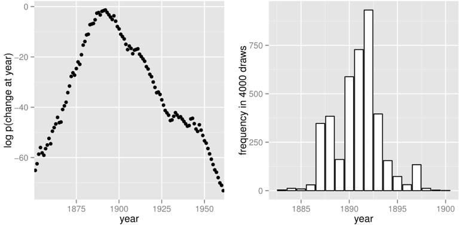

## 15. 潜在離散パラメーター

Stanは離散パラメーターのサンプリングをサポートしていません。そのため、BUGSやJAGSのモデルで、離散パラメーター（すなわち、離散値をとる確率変数のノード）のあるものをそのまま移植することはできません。それでも、離散パラメーターを周辺化消去することにより、上下限のある離散パラメーターを含むたくさんのモデルをコーディングすることができます。^[この計算は、期待値最大化(EM: Expectation Maximization)アルゴリズムに含まれるものに似ています(Dempster et al., 1977)。]この章では、潜在離散パラメーターを含むモデルのうち広く使われているものいくつかをコーディングする方法を紹介します。この後の17章では、クラスタリングモデルについて、潜在離散パラメーターを含むモデルについてさらに検討します。

### 15.1 周辺化の利点

離散パラメーターを周辺化消去するには、同時確率関数の何らかの代数計算が必要になりますが、この計算のうれしい副産物が、周辺化された変数の事後期待値です。その変数がモデル中で関心のある量であることが多いですし、また事後期待値は、離散パラメーターのサンプリングによって推定された期待値ではなく、とりうる値すべてについての期待値が用いられます。そのため、分布の裾もしっかりと探られるほか、個々のiterationベースでも、より効率的なサンプリングが可能になります。

期待値最大化(EM: Expectation Maximization)アルゴリズムはじめ、標準的な最適化アルゴリズムは多くが、最尤推定アルゴリズムを記述する応用統計学の論文として公表されています。Stanでモデルをコーディングするのに必要な周辺化は、まさにこのような論文に由来します。

### 15.2 変化点モデル

最初の例は、1851年から1962年の、イギリスの炭鉱災害のモデルです。^[このデータの出典は(Jarrett, 1979)ですが、この論文自体は、前からあるデータ集を訂正した短信です。]

#### 潜在離散パラメーターのあるモデル

Fonnesbeck et al. (2013)の3.1節では、年$t$における災害発生数^[訳注: 原文は'disaster rate'ですが、原典では'number of disasters'となので、「災害発生数」と思われます] $D_{t}$ のポアソンモデルが紹介されています。このモデルには、初期発生率($e$)と後期発生率($l$)の2つの発生率パラメーターがあり、ある時点$s$で切り替わるとされています。フルモデルは、潜在離散パラメーター$s$を使うと以下のようになります。

$$\begin{array}{ll}e &\sim \mathrm{Exponential}(r_e) \\ l &\sim \mathrm{Exponential}(r_l) \\ s &\sim \mathrm{Uniform}(1,T) \\ D_t &\sim \mathrm{Poisson}(t < s\;?\;e : l)\end{array}$$

最後の行では条件演算子（3値演算子ともいいます）を使っています。これは、Cおよびそれに類する言語から借りてきたものです。条件演算子は、Rの`ifelse`関数と同じ挙動を示しますが、より簡潔な記法を使い、疑問符(?)とコロン(:)で3つの引数を区切ります。条件演算子は以下のように定義されます。

$$c\;?\;x_1 : x_2 = \begin{cases} x_1 \quad c\text{が真（つまり非零）のとき} \\ x_2 \quad c\text{が偽（つまり零）のとき} \end{cases}$$

Stanは、version 2.10から条件演算子をサポートしています。

#### 離散パラメーターの周辺化消去

このモデルをStanでコーディングするには、離散パラメーター$s$を周辺化消去して、確率関数$p(e,l,D_{t})$の対数を定義するモデルを作らなくてはなりません。
フル同時確率は以下のようになります。

$$\begin{array}{ll}p(e,l,s,D) &= p(e)p(l)p(s)p(D \mid s,e,l) \\ &= \mathrm{Exponential}(e \mid r_{e}) \mathrm{Exponential}(l \mid r_{l}) \mathrm{Uniform}(s \mid 1, T) \\ & \quad \prod_{t=1}^{T}\mathrm{Poisson}(D_{t} \mid t<s\;?\;e : l)\end{array}$$

周辺化のため、別のやり方で事前分布と尤度とに分解します。

$$p(e,l,D) = p(e,l)p(D \mid e,l)$$

ここで、$s$を周辺化した尤度は以下のように定義されます。

$$\begin{array}{ll}p(D \mid e,l) &= \sum_{s=1}^{T}p(s,D \mid e,l) \\ &= \sum_{s=1}^{T}p(s)p(D \mid s,e,l) \\ &= \sum_{s=1}^{T}\mathrm{Uniform}(s \mid 1,T)\prod_{t=1}^{T}\mathrm{Poisson}(D_{t} \mid t<s\;?\;e:l)\end{array}$$

Stanは対数スケールで処理をおこないますので、対数尤度が必要です。

$$\begin{array}{ll}\log p(D \mid e,l) &= \mathrm{log\_sum\_exp}_{s=1}^{T}\left(\log\mathrm{Uniform}(s \mid 1,T)\right. \\ &\quad\left. + \sum_{t=1}^{T}\log\mathrm{Poisson}(D_{t} \mid t<s\;?\;e : l)\right)\end{array}$$

ここで、指数の合計の対数関数は以下のように定義されます。

$$\mathrm{log\_sum\_exp}_{n=1}^{N}\alpha_{n} = \log\sum_{n=1}^{N}\exp(\alpha_{n})$$

指数の合計の対数関数は、Stanでは`log_sum_exp`として組み込まれていますので、これを使ってモデルをそのままコーディングできます。これにより、算術的にも安定し、混合分布モデルの計算も効率的になります。

#### Stanでのモデルのコーディング

変化点モデルのStanのプログラムは図15.1に示します。変換パラメーター(transformed parameter) `lp[s]`は$\log p(s,D \mid e,l)$の値を格納します。

```
data {
  real<lower=0> r_e;
  real<lower=0> r_l;
  int<lower=1> T;
  int<lower=0> D[T];
}
transformed data {
  real log_unif;
  log_unif = -log(T);
}
parameters {
  real<lower=0> e;
  real<lower=0> l;
}
transformed parameters {
  vector[T] lp;
  lp = rep_vector(log_unif, T);
  for (s in 1:T)
    for (t in 1:T)
      lp[s] = lp[s] + poisson_lpmf(D[t] | t < s ? e : l);
}
model {
  e ~ exponential(r_e);
  l ~ exponential(r_l);
  target += log_sum_exp(lp);
}
```

図15.1: 変化点モデル。災害発生数`D[t]`は、変化点の前ではある発生率`e`に、変化点の後では別の発生率`l`に従います。変化点自身は`s`であり、本文の記述のように周辺化消去されています。

図15.1のモデルは理解しやすいのですが、`s`と`t`に使われる2重にネストしたループのため、`T`について2次となります。Luke Wiklendtは、隠れマルコフモデルの前進後退アルゴリズムに似たダイナミックプログラミングを使用した線形の別の方法でうまくできることを指摘しました。彼の投稿したコードは以下のコードとよく似たもので、上のStanプログラムの`transformed parameters`ブロックを置き換えるものです。

```
transformed parameters {
  vector[T] lp;
  {
    vector[T + 1] lp_e;
    vector[T + 1] lp_l;
    lp_e[1] = 0;
    lp_l[1] = 0;
    for (t in 1:T) {
      lp_e[t + 1] = lp_e[t] + poisson_lpmf(D[t] | e);
      lp_l[t + 1] = lp_l[t] + poisson_lpmf(D[t] | l);
     }
    lp = rep_vector(log_unif + lp_l[T + 1], T)
         + head(lp_e, T) - head(lp_l, T);
  }
}
```

見て明らかなように、複雑さは`T`について2次ではなく線形です。炭鉱災害のデータでおよそ20倍高速という結果になります。より大きな`T`ではさらに効果は大きくなります。

Wiklendtのダイナミックプログラミングのバージョンを理解する鍵は、`head(lp_e)`が前進の値を保持し、`lp_l[T + 1] - head(lp_l, T)`が後退の値を保持することに気付くことです。減算をうまく使うことで、`lp_l`が自然に前進方向で値を蓄積できます。

#### MCMCによるモデルの当てはめ

このモデルは、デフォルト設定のNUTSによるMCMCで簡単に当てはめができます。収束はとても速く、サンプリングでは、おおよそ2回の繰り返しあたり1個の有効サンプルが得られます。相対的に小さなモデルなので（時間についての内部の2重ループはおおよそ20000ステップ）、とても速いのです。

`lp`は変換パラメーター(transformed parameter)として宣言されていますので、各変化点についてiterationごとの`lp`の値を得ることもできます。もし`lp`の値に関心がないのであれば、局所変数としてコーディングできます。この場合、iterationごとに値を保存することによるI/Oのオーバヘッドがなくなります。

#### 離散変化点の事後分布

あるiterationにおける`lp[s]`の値は、そのiterationにおける初期発生率$e$と後期発生率$l$の値を用いて、$\log p(s,D \mid e,l)$により与えられます。収束後はiterationごとに、初期および後期災害発生率$e$および$l$が、事後の$p(e,l \mid D)$からMCMCサンプリングにより抽出され、関連する`lp`が計算されます。`lp`の値は、各iterationにおけるその時点での$e$と$l$の値にもとづいて、$p(s \mid e,l,D)$を計算することで正規化できるでしょう。iteration全体を平均すると、変化点が$s$であることの正規化されていない確率の推定値が得られます。

$$\begin{array}{ll}p(s \mid D) &\propto q(s \mid D) \\ &= \frac{1}{M}\sum_{m=1}^{M}\exp(\mathrm{lp}[m,s])\end{array}$$

ここで、`lp`[$m$,$s$]は、事後抽出$m$における変化点$s$についての`lp`の値を表します。抽出全体を平均すると、$e$と$l$の方が周辺化消去され、ある繰り返しでの$e$と$l$の値には結果は依存しなくなります。最終的に正規化すると、求めたい量、すなわちデータ$D$を条件とする、$s$が変化点であることの事後確率が得られます。

$$p(s \mid D) = \frac{q(s \mid D)}{\sum_{s'=1}^{T}q(s' \mid D)}$$

Stan 2.4のデフォルトのMCMC実装を使って計算した$\log p(s \mid D)$の値のグラフを図15.2に示します。



図15.2: 変化点の事後推定値。左) `lp`を使って解析的に計算した、各年が変化点である対数確率。右) `lp`を使って生成した事後分布における変化点の抽出の頻度。左のグラフは対数スケールで、右のグラフは線形スケールです。右側のグラフではサンプリングのために年の範囲が狭くなっていることに注意。$s$の事後平均はおよそ1891です。

#### 離散サンプリング

`generated quantities`ブロックを利用すると、組込みの擬似乱数発生器を使って離散パラメーター値を抽出することができるでしょう。例えば、`lp`を上のように定義すると、繰り返しごとの`s`のランダムな値を抽出するプログラムは以下のようになります。

```
generated quantities {
  int<lower=1,upper=T> s;
  s <- categorical_rng(softmax(lp));
}
```

`s`の抽出の事後分布のヒストグラムを図15.2の右側に示します。

期待値について計算するのと比べると、離散サンプリングはとても非効率的です。とくに分布の裾ではそうですので、こうした手法は、分布からの抽出が明示的に必要なときにだけ使うべきです。そうでないときは期待値を計算すべきでしょう。`softmax(lp)`が与えられたときの`s`の事後分布にもとづいて`generated quantities`ブロックで計算できます。

#### 事後共分散

`s`について生成された離散サンプルは、他のパラメーターとの共分散を計算するのにも使えます。このサンプリング手法は単純ですが、期待される共分散を`lp`を使って計算するのが（同じ程度の精度を得るのに必要な繰り返しがはるかに少ないという意味で）より統計学的に効率的です。

#### 多変化点

複数の変化点を持たせるのも原理的には難しいことはありません。問題は計算が増えることだけです。1変化点では1次だった周辺化消去が、2変化点では2次になり、3変化点では3次、というふうになります。変化点が2つのときは、期間のパラメーターは3つ、`e`, `m`, `l`となり、変化点についての2つのループと、時間全体についての1つのループを設定します。変化点が2つなので、対数密度は行列に格納されます。

```
matrix[T,T] lp;
  lp <- rep_matrix(log_unif,T);
  for (s1 in 1:T)
    for (s2 in 1:T)
      for (t in 1:T)
        lp[s1,s2] <- lp[s1,s2]
          + poisson_log(D[t], if_else(t < s1, e, if_else(t < s2, m, l)));
```

この行列は、`log_sum_exp`に渡す前に`to_vector`でベクトルに戻すことができます。

### 15.3 標識再捕獲モデル

生態学の野外調査法で広く応用されているものに、動物を捕獲（または視認）し、（タグなどで）標識して、それから放すという方法があります。このプロセスはさらに1回以上繰り返され、多くの場合は調査継続中の集団^[訳注:'population'は、生態学では「個体群」と訳すのが普通ですが、遺伝学では「集団」と訳しますし、その方がわかりやすいでしょうから、ここでは「集団」と訳しています。] に対して行なわれます。結果のデータは、集団サイズを推定するのに使うことができます。

最初の小節では、潜在離散パラメーターを含まないごく単純な捕獲再捕獲モデルを記述します。その後の小節では、動物の死についての潜在離散パラメーターを含むCormack-Jolly-Seberモデルを記述します。

#### 単純な標識再捕獲モデル

もっとも単純な場合では、1段階の標識再捕獲調査から以下のデータが得られます。

- $M$: 最初の捕獲で標識された動物の数
- $C$: 2回目に捕獲された動物の数
- $R$: 2回目に捕獲されたうち標識されていた動物の数

目的の推定対象は以下です。

- $N$: 集団内の動物の数

上の説明と話が違うのですが、このモデルでは$N$を連続パラメーターとしましょう。集団は有限でなくてはならないといっても、それを表すパラメーターはその限りではありません。このパラメーターは、集団サイズの推定値を実数値で求めるのに使います。

Lincoln-Petersen法(Lincoln, 1930; Petersen, 1896)を集団サイズの推定に使います。

$$\hat{N} = \frac{MC}{R}$$

この集団推定値は、再捕獲された動物の数が二項分布に従うという確率モデルに基づいたものでしょう。

$$ R \sim \mathsf{Binomial}(C, M/N) $$

ここでは、2回目に捕獲された動物の数の合計($C$)と、再捕獲率$M/N$を与えています。再捕獲率は、全個体数$N$のうち、最初に標識された個体の割合に等しいとしています。

Lincoln-Petersen推定量を確率的にしたものは、図15.3のようにStanではそのままコーディングできます。このときのLincoln-Petersen推定値はこのモデルでは最尤推定値(MLE)です。

```
data {
  int<lower=0> M;
  int<lower=0> C;
  int<lower=0,upper=min(M,C)> R;
}
parameters {
  real<lower=(C - R + M)> N;
}
model {
  R ~ binomial(C, M / N);
}
```

図15.3: Lincoln-Petersen推定量の確率的定式化。1段階標識再捕獲調査からのデータに基づいて集団サイズを推定します。ありえない値を効率的に除くため、Nの下限は必要です。

最尤推定値が確実にLincoln-Petersen推定値になるように、$N$には非正則一様事前分布が使われています。可能であれば、調査している集団についての知識に基づいて、もっと情報のある事前分布を使うこともできるでしょう（そしてそうすべきです）。

このモデルでトリッキーなところは、集団サイズ$N$の下限$C-R+M$でしょう。これより小さい値では、再捕獲された$C$匹の動物から$R$だけのサンプルを抽出することができないので、この下限より小さな値は取りえないのです。変換された（制約のない）空間でのパラメーターに制限がかからないようにして、サンプリングと最適化が制約なく行なわれるのを確実にするため、この下限を実装することは必要です。$C$について宣言されたこの下限は、次の変数変換を暗黙のうちに伴います: $f:(C-R+M, \infty) \rightarrow (-\infty, +\infty)$、$f$は$f(N) = \log(N-(C-R+M))$と定義されます。下限を宣言する変数に使われる変換についてさらに知るには34.2節を参照してください。

#### 離散パラメーターのあるCormack-Jolly-Seberモデル

Cormack-Jolly-Seber (CJS)モデル(Cormack, 1964; Jolly, 1965; Seber, 1965)は、死亡により集団が時間的に変化する開放集団モデルです。ここで紹介している例は(Schofield, 2007)から多くを引いてきています。

基本データは以下のとおりです。

- $I$: 個体数
- $T$: 捕獲時点の数
- $y_{i,t}$: 個体$i$が時点$t$に捕獲されたかどうかを示す論理値

各個体は少なくとも1回は捕獲されていると仮定されます。これは、最初に捕獲された後という条件付きでしか個体が情報に寄与しないからです。

このモデルには2個のベルヌーイパラメーターがあります。

- $\phi_{t}$: 時点$t$で生存していた動物が$t+1$まで生存する確率
- $p_{t}$: 時点$t$で生存していた動物が時点$t$に捕獲される確率

これらパラメーターには一様事前分布を与えますが、実際には情報を使って事前分布を狭くするべきでしょう。

CJSモデルはまた、潜在離散パラメーター$z_{i,t}$を使います。これは、各個体$i$が時点$t$で生存しているかどうかを示すものです。

$$z_{i,t} \sim \mathsf{Bernoulli}(z_{i,t-1}\;?\;0 : \phi_{t-1})$$

この条件によりゾンビが発生することを防ぎます。つまり、動物はいったん死んだらならば、ずっと死んだままになります。データの分布は$z$を条件として単純に以下のように表されます。

$$y_{i,t} \sim \mathrm{Bernoulli}(z_{i,t}\;?\;0 : p_{t})$$

この条件により、死亡した動物は捕獲されることがないという制約がつけられます。

#### 集合Cormack-Jolly-Seberモデル

この小節では、3回の捕獲調査を行なった場合について、個体の捕獲プロファイルの別を計数するというモデルの実装を紹介します。このモデルは、どの動物も同じ捕獲率と同じ生存率を持つという交換可能性を仮定しています。

潜在離散パラメーター$z<sub>i,t</sub>$の周辺化を簡単にするため、Stanのモデルでは、ある時点$t$で生存していた個体（死亡していれば、再捕獲率は0です）がもう2度と捕獲されない確率$\chi_{t}$をうまく使います。この量は再帰的に定義されます。

$$\begin{array}{ll}\chi_{t} = \begin{cases} 1 &\quad t = Tのとき \\ (1 - \phi_{t}) + \phi_{t}(1 - p_{t+1})\chi_{t+1} &\quad t < Tのとき \end{cases}\end{array}$$

ある個体が最終調査時に捕獲された場合、このとき、もう捕獲調査はありませんので、もう捕獲されない確率は1になります。そのため、これが再帰のベースになります。$\chi_{t+1}$から、再帰的に$\chi_{t}$を定義しますが、この場合には2つの確率が含まれます。(1)確率($1-\phi_{t}$)で、次回調査時点まで生存しない、(2)確率$\phi_{t}$で、次回調査時点まで生存するが、次回調査時点では確率($1-p_{t+1}$)で捕獲されず、かつ、確率$\chi_{t+1}$で、時点$t+1$で生存していた後に2度と捕獲されない。

3回の捕獲調査の場合、ある個体についての捕獲/非捕獲のプロファイルが3つあることになります。これは2値の数字として以下のように自然に符号化されます。

|プロファイル| 捕獲/1 2 3 | 確率 |
|:--------:|:--------:|:----:|
| 0 | \- \- \- | n/a |
| 1 | \- \- \+ | n/a |
| 2 | \- \+ \- |$\chi_{2}$|
| 3 | \- \+ \+ | $\phi_{2}\phi_{3}$|
| 4 | \+ \- \- | $\chi_{1}$|
| 5 | \+ \- \+ | $\phi_{1}(1-p_{2})\phi_{2}p_{3}$|
| 6 | \+ \+ \- | $\phi_{1}p_{2}\chi_{2}$|
| 7 | \+ \+ \+ | $\phi_{1}p_{2}\phi_{2}p_{3}$|

履歴0、すなわち動物が1度も捕獲されない場合は観測不可能です。捕獲された動物だけが観測されるからです。履歴1、すなわち最終回にのみ動物が捕獲される場合は、CJSモデルでは情報は得られません。捕獲/非捕獲の状態から情報が得られるのは、前の捕獲を条件としたときだけだからです。残りの場合には、最後の列に示したように尤度への寄与があります。

$\chi$を使って直接こうした確率を定義することで、動物が時点$t$で生きているかどうかを示す潜在2値パラメーターは必要なくなります。この$\chi$の定義は、CJSモデルでの尤度（すなわち潜在離散パラメーターを周辺化消去した）の定義では典型的です(Schofield, 2007, 9ページ)。

Stanのモデルでは、パラメーター$\phi$と$p$に基づいて変換パラメーター(transformed parameter)として$\chi$を定義しています。`model`ブロックでは、各履歴についてその回数に応じて対数確率が加算されます。2番目のステップは、ベルヌーイ分布の観測値を二項分布に、あるいはカテゴリカルな観測値を多項分布にまとめるのと似ています。ただし、このStanのプログラムでは組込みの確率関数を使わず、`increment_log_prob`を使って直接コーディングしています。

```
data {
  int<lower=0> history[7];
}
parameters {
  real<lower=0,upper=1> phi[2];
  real<lower=0,upper=1> p[3];
}
transformed parameters {
  real<lower=0,upper=1> chi[2];
  chi[2] = (1 - phi[2]) + phi[2] * (1 - p[3]);
  chi[1] = (1 - phi[1]) + phi[1] * (1 - p[2]) * chi[2];
}
model {
  target += history[2] * log(chi[2]);
  target += history[3] * (log(phi[2]) + log(p[3]));
  target += history[4] * (log(chi[1]));
  target += history[5] * (log(phi[1]) + log1m(p[2])
                            + log(phi[2]) + log(p[3]));
  target += history[6] * (log(phi[1]) + log(p[2])
                            + log(chi[2]));
  target += history[7] * (log(phi[1]) + log(p[2])
                            + log(phi[2]) + log(p[3]));
}
generated quantities {
  real<lower=0,upper=1> beta3;
  beta3 = phi[2] * p[3];
}
```

図15.4: Cormack-Jolly-Seber標識再捕獲モデルのStanプログラム。3回の捕獲調査での観測のありなしという観測履歴ごとに個体の数をまとめています。

##### 識別可能性

パラメーター$\phi_{2}$と$p_{3}$、すなわち時点2での生存率^[訳注:原文ではprobability of deathとなっていますが、$\phi$の定義は「生存率」です]と時点3での捕獲率とは識別可能ではありません。これは、時点3で捕獲されなかったことの説明にこの両方ともが使えるからです。これらの積$\beta_{3}=\phi_{2}p_{3}$は識別可能です。Stanのモデルでは`beta3`を生成量(generated quantity)として定義しています。識別不可能なパラメーターは、Stanのサンプラーの適応(adaptation)に問題を引き起こします。パラメーターに制限があって、正則一様分布が使われていたため、このモデルでは適応に大きな問題は発生しませんでしたが、識別可能なパラメーターとなるように定式化した方が良いでしょう。そのためには、$p$と$\phi$のパラメーターについて階層モデルとして定式化するのもひとつの方法でしょう。

#### 個体Cormack-Jolly-Seberモデル

この小節では、前の小節で紹介したような集合的なものではなく、個体レベルで動くバージョンのCormack-Jolly-Seber (CJS)モデルを紹介します。また、これによりモデルは、任意の調査回数に対応することができるようになります。データは、捕獲調査の回数$T$、個体数$I$、個体$i$が時点$t$で観測されたかを示す論理値フラグ$y_{i,t}$からなります。Stanでは以下のように記述されます。

```
data {
  int<lower=2> T;
  int<lower=0> I;
  int<lower=0,upper=1> y[I,T];
}
```

個体レベルモデルの利点に、生存率や捕獲率に影響する個体の「ランダム効果」を含めることが可能になります。そのほか、$T$回の捕獲があった場合$2^{T}$個の観測履歴を展開した組み合わせを使わなくて良いという点もあります。

##### ユーティリティ関数

この個体CJSモデルは、いくつかの関数定義を含むように書かれています。はじめの2つは、`transformed data`ブロックで使われており、動物が捕獲された最初および最後の調査時点を計算します。^[別の方法として、この値をモデルの外で計算して、Stanのモデルに前処理済みデータとして与えることもできるでしょう。さらに別のコーディングとして、捕獲イベントのときにその時点と捕獲された個体とを記録するという疎なものもあります。]

```
functions {
  int first_capture(int[] y_i) {
    for (k in 1:size(y_i))
      if (y_i[k])
        return k;
    return 0;
  }
  int last_capture(int[] y_i) {
    for (k_rev in 0:(size(y_i) - 1)) {
      int k;
      k = size(y_i) - k_rev;
      if (y_i[k])
        return k;
    }
    return 0;
  }
  ...
}
```

この2つの関数は、`transformed data`ブロックで各個体の最初と最後の捕獲時点を定義するのに使われます。^[入力された配列の個体が1度も捕獲されていないときは、両方の関数とも0を返します。このモデルでは、どの確率計算もより前の捕獲を条件としているので、捕獲されていない個体はモデルの推定に無関係です。通常はこうしたデータは除かれるのですが、このプログラムでは、対数確率関数への寄与はなくとも、そうしたデータが含まれてもよいようになっています。]

```
transformed data {
  int<lower=0,upper=T> first[I];
  int<lower=0,upper=T> last[I];
  vector<lower=0,upper=I>[T] n_captured;
  for (i in 1:I)
    first[i] = first_capture(y[i]);
  for (i in 1:I)
    last[i] = last_capture(y[i]);
  n_captured = rep_vector(0, T);
  for (t in 1:T)
    for (i in 1:I)
      if (y[i, t])
        n_captured[t] = n_captured[t] + 1;
}
```

`transformed data`ブロックでは`n_captured[t]`も定義しています。これは、時点`t`における捕獲数の合計値です。`n_captured[t]`変数は、整数配列ではなくベクトルとして定義されています。これにより、各時点での集団推定値をモデル化するために`generated quantities`ブロックで要素ごとのベクトル操作を使えるようになります。

パラメーターと変換パラメーターは前のとおりですが、ある個体が時点$t$で生きていたときにその2度と捕獲されない確率として、ベクトル`chi`を全部計算する関数が定義されています。

```
parameters {
  vector<lower=0,upper=1>[T-1] phi;
  vector<lower=0,upper=1>[T] p;
}
transformed parameters {
  vector<lower=0,upper=1>[T] chi;
  chi = prob_uncaptured(T, p, phi);
}
```

`prob_uncaptured`の定義は`functions`ブロックに置きます。

```
functions {
  ...
  vector prob_uncaptured(int T, vector p, vector phi) {
    vector[T] chi;
    chi[T] = 1.0;
    for (t in 1:(T - 1)) {
      int t_curr;
      int t_next;
      t_curr = T - t;
      t_next = t_curr + 1;
      chi[t_curr] = (1 - phi[t_curr])
                     + phi[t_curr]
                       * (1 - p[t_next])
                       * chi[t_next];
    }
    return chi;
  }
}
```

この関数は$\chi_{t}$の数学的定義をそのままなぞったものです。再帰を繰り返しに展開し、`T`から1まで`chi`の要素を定義しています。

##### モデル

前もって計算させた量を与えられたもとで、`model`ブロックではCJSモデルの対数尤度関数をそのままエンコードしています。すべてのパラメーターの事前分布はデフォルトの一様事前分布とし、パラメーター`p`および`phi`と、`p`および`phi`から定義される変換パラメーター`chi`とが与えられたもとでの観測`q`の対数確率をモデルは単純にエンコードしています。

```
model {
  for (i in 1:I) {
    if (first[i] > 0) {
      for (t in (first[i]+1):last[i]) {
        1 ~ bernoulli(phi[t-1]);
        y[i,t] ~ bernoulli(p[t]);
      }
      1 ~ bernoulli(chi[last[i]]);
    }
}
```

外側のループは全個体についてのもので、1度も捕獲されていない個体`i`は飛ばすという条件がついています。1度も捕獲されていないことのチェックには、1度も捕獲されていない個体では初回および最終捕獲の関数が0を返すという決まりにより、`first`が0になることを利用しています。

内側のループは個体`i`について、個体が確率`phi[t-1]`で生存することに基づいて対数確率をまず加算します。結果が1で固定されているのは、最初と最後の捕獲の間にはその個体は生存していることが確実だからです（ゾンビはいません）。このループは最初の捕獲の後から始まります。これはCJSモデルでは全情報が最初の捕獲を条件としているからです。

内側のループでは、個体`i`の時点`t`における観測捕獲状態`y[i,t]`は、時点`t`における捕獲率`p[t]`に基づいたベルヌーイ分布に従います。

内側のループの後には、ある動物が時点`last[i]`で観測されてから2度と確認されない確率を入れています。これは、`last[i]`が、動物`i`が観測された最後の調査時点と定義されているからです。

##### 識別されるパラメーター

前の小節で記述した集合モデルと同じく、このモデルでも`phi[T-1]`と`p[T]`は識別可能ではありません。識別可能なのはその積`beta`です。そこで、genetated quantityとして`beta`を定義し、収束の監視と報告の対象とします。

```
generated quantities {
  real beta;
  ...

  beta <- phi[T-1] * p[T];
  ...
}
```

パラメーター`p[1]`もモデル化されていませんし、0から1の一様分布となるだけでしょう。もっとうまくモデルをつくるなら、階層的成分や、時系列成分を含めるようにするとよいかもしれません。その場合、`p[1]`は未知の初期状態となり、`phi[T-1]`と`p[T]`はともに識別可能となるでしょう。

##### 集団サイズの推定値

generated quantitiesでは、各時点`t`における集団サイズの平均の推定値も計算します。方法は、単純な標識再捕獲モデルと同様で、時点`t`における捕獲個体数を、時点`t`における捕獲確率で割って求めます。ここでは、`generated quantities`ブロックで、`vector`の要素ごとの除算演算子(./)を使用します。

```
generated quantities {
  ...
  vector<lower=0>[T] pop;
  ...
  pop = n_captured ./ p;
  pop[1] = -1;
}
```

##### 個体効果への一般化

このモデルは、個体すべてが同じ捕獲率と持つというふうにモデル化されていますが、一般化は簡単にできるでしょう。その場合、個体レベルの入力値を予測変数として使って、これに基づくロジスティック回帰を使います。

### 15.4 データ符号化と診断正答率のモデル

かけはなれた仕事のように見えますが、アイテムをカテゴリーに分けて評価/符号化/注釈するのと、病気か病気でないかを診断検査することとの間には共通する特徴があり、両者の統計的特性は同じようにモデル化できます。

#### 診断正答率

さまざまな感度と特異度の条件で診断検査を行なうとします。感度とは、検査をうける人が疾患ありの時に正しく検査が陽性となる確率です。特異度は、検査をうける人が疾患なしの時に正しく検査が陰性となる確率です。乳癌の検査方法であるマンモグラムと穿刺生検を例にします。マンモグラムの感度は高く、特異度は低いのですが、これは偽陽性が多いことを意味します。一方、穿刺生検は反対で、感度は低く特異度は高いので、偽陰性が多くなります。

こうした調査ではいくつかの推定対象があります。疫学調査では、集団内でマラリアのようなある種の感染症に罹っている患者数に関心があるでしょう。検査法を開発する研究では、新しい検査法の診断正答率に関心があるでしょう。健康管理従事者が行なう検査では、ある患者の病状に関心があるでしょう。

#### データ符号化

データに符号をつける（評価や注釈も同様）仕事を与えられることはよくあります。例えば、論文誌や助成金の審査員は提出物を評価しますし、政治学の研究では、キャンペーンコマーシャルが攻撃的広告か否かを符号化したりするでしょう。自然言語処理では、ツイートが全体的な感情に照らしてポジティブかネガティブか注釈をつけるでしょうし、X線画像を見る歯科医は患者が虫歯かどうかを分類します。このような場合、データに符号をつける人は診断検査の役を演じており、すべての場合に共通するような推定対象があります。すなわち、データにつけた符号の正答率とバイアス、符合をつけたアイテムの真のカテゴリー、データ中のアイテムのさまざまなカテゴリーはそれぞれいくつあるか、といったことです。

#### ノイズのあるカテゴリー測定モデル

この小節では、カテゴリー評価だけに絞って、離散パラメーターを周辺化消去してStanでモデリングすることを考えます。

Dawid and Skene (1979)は、データ符号化にノイズのある測定モデルを導入して、医師による記録から患者の履歴についてわかることを符号化するという疫学的状況に応用しています。同じモデルは診断法についても使用できます。

##### データ

データは、$J$評価者（診断検査）、$I$アイテム（患者）、$K$カテゴリー（状態）の注釈からなり、$y_{i,j} \in 1:K$は、アイテム$i$について評価者$j$がつけた評価です。ある状態についての診断検査の状況では、評価者は診断法であり、多くは$K = 2$、つまり疾患があるかないかの信号の値になります。^[診断法では順序尺度となることも多くあります。腫瘍学的診断での癌の段階や、歯科診断での虫歯の深刻度といったものです。Dawid and Skeneのモデルはそのままでも使えますし、順序ロジスティック回帰として、潜在連続値の評価とカットポイントを使い、順序をつけて評価するように自然に一般化してもよいでしょう。]

全評価者が全アイテムを1度だけ評価するとは限らないという状況にDawid and Skeneのモデルを拡張するのは比較的素直にできます。

#### モデルパラメーター

このモデルは3つのパラメーターを持ちます。最初のひとつは離散的です。

- $z_{i}$: 1:$K$の値をとり、アイテム$i$の真のカテゴリーを示します。
- $\pi$: 集団内での$K$カテゴリーの出現率を示す$K$次元単体
- $\theta_{j,k}$: 注釈者$j$の反応を示す、真のカテゴリー$k$のアイテムについての$K$次元単体

#### ノイズのある測定モデル

あるアイテムの真のカテゴリーは、アイテムの出現率をもとに単純なカテゴリカル分布で生成されると仮定します。

$$z_{i} \sim \mathsf{Categorical}(\pi)$$

アイテム$i$についての評価者$j$の評価$y_{i,j}$は、カテゴリー$z_{i}$のアイテムに対する評価者$i$のカテゴリカルな応答としてモデル化します。^[添字の$z[i]$は、$z_{i}$を読みやすくしたものです。]

$$y_{i,j} \sim \mathsf{Categorical}(\theta_{j,\pi_{z[i]}})$$

##### 事前分布と階層モデリング

Dawid and Skeneは$\theta$と$\pi$の最尤推定値を提供しています。これにより、各$z_{i}$の確率の推定値を生成できます。

Dawid and Skeneの最尤モデルをまねるため、パラメーター$\theta_{j,k}$と$\pi$には$K$次元単体についての一様事前分布を与えます。一般化してディリクレ事前分布にするのも簡単です。

$$\pi \sim \mathsf{Dirichlet}(\alpha)$$

および

$$\theta_{j,k} \sim \mathsf{Dirichlet}(\beta_{k})$$

$\alpha$と$\beta$は固定された値を持つハイパーパラメーターです。$\theta_{j,k}$の事前分布は$k$によって変わることができるようにしないといけません。そうすると例えば、偶然よりも良い注釈をする注釈者が、ランダムまたは反対に注釈する注釈者よりも高い事前確率を持てるように$\beta_{k,k}$を大きくできるようになります。

$J$だけ評価者がいるので、$\beta$に階層事前分布をつけて、評価者の正答率とバイアスの推定値を部分的に合算するようにモデルを拡張するのは自然なことでしょう。

##### 真のカテゴリーの周辺化消去

真のカテゴリーのパラメーター$z$は離散的ですので、同時事後分布から周辺化消去して、Stanでサンプリングあるいは最尤推定ができるようにします。同時事後分布の因子は以下のようになります。

$$p(y,\theta,\pi) = p(y \mid \theta, \pi)p(\pi)p(\theta)$$

ここで、$p(y \mid \theta,\pi)$は、次式から$z$を周辺化消去して得られます。

$$p(z, y \mid \theta,\pi) = \prod_{i=1}^{I}\left(\mathsf{Categorial}(z_{i} \mid \pi) \prod_{j=1}^{J}\mathsf{Categorical}(y_{i,j} \mid \theta_{j,z[i]})\right)$$

この式はアイテムごとの形式にできます。

$$p(y \mid \theta,\pi) = \prod_{i=1}^{I}\sum_{k=1}^{K}\left(\mathsf{Categorial}(z_{i} \mid \pi) \prod_{j=1}^{J}\mathsf{Categorical}(y_{i,j} \mid \theta_{j,z[i]})\right)$$

欠測データモデルでは、内側の積の部分で観測されたかどうかのラベルだけを使うようにすればよいでしょう。

Dawid and Skene (1979)は、まったく同じ式を彼らの式(2.7)で導出しています。これは、彼らの期待値最大化(EM)アルゴリズムにおけるEステップに必要となるものです。Stanでは対数スケールでの周辺化確率関数が必要になります。

$$\log p(y \mid \theta,\pi) = \sum_{i=1}^{I}\log\left(\sum_{k=1}^{K}\exp\left(\log\mathsf{Categorial}(z_{i} \mid \pi) + \sum_{j=1}^{J}\log\mathsf{Categorical}(y_{i,j} \mid \theta_{j,z[i]})\right)\right)$$

この式はStanの組込み`log_sum_exp`関数を使ってそのままコーディングできます。

#### Stanでの実装

Dawid and SkeneモデルのStanプログラムを図15.5に示します。NUTSを使うStanのモデルは、ばらばらの初期値から素早く収束し、よく混合されます。離散パラメーターをギブズサンプリングするように実装した同等のモデルではそうはいきません。適切な弱情報事前分布として、$\alpha_{k} = 3$、$\beta_{k,k} = 2.5K$、$\beta_{k,k'} = 1$（$k \neq k'$のとき）としています。$\alpha$と$\beta_{k}$を単位ベクトルにして、最適化を適用すると、Dawid and Skene (1979)の期待値最大化(EM)アルゴリズムと同じ結果が得られるでしょう。

```
data {
  int<lower=2> K;
  int<lower=1> I;
  int<lower=1> J;
  int<lower=1,upper=K> y[I, J];
  vector<lower=0>[K] alpha;
  vector<lower=0>[K] beta[K];
}
parameters {
  simplex[K] pi;
  simplex[K] theta[J, K];
}
transformed parameters {
  vector[K] log_q_z[I];
  for (i in 1:I) {
    log_q_z[i] = log(pi);
    for (j in 1:J)
      for (k in 1:K)
        log_q_z[i, k] = log_q_z[i, k]
                         + log(theta[j, k, y[i, j]]);
  }
}
model {
  pi ~ dirichlet(alpha);
  for (j in 1:J)
    for (k in 1:K)
      theta[j, k] ~ dirichlet(beta[k]);

  for (i in 1:I)
    target += log_sum_exp(log_q_z[i]);
}
```

図15.5: Dawid and Skene (1979)の評価（あるいは診断精度）モデルのStanプログラム。このモデルは、離散パラメーター$z$を周辺化消去し、非正規化条件付き確率$\log q(z_{i} = k \mid \theta,\pi)$を`log_q_z[i,k]`に格納しています。

##### 真のカテゴリーの推定

`log_q_z[i]`は変換パラメーター(transformed parameter)として定義されます。これは、$p(z_{i} \mid \theta,\pi)$の対数（正規化されていません）をコード化したものです。繰り返しごとに、その繰り返しでの$\theta$と$\pi$との値を条件とした値が得られます。softmax関数を`log_q_z[i]`に適用することで、事後の$z_{i}$の確率質量関数に相当する単体が得られます。これを各繰り返しについて平均することで、それぞれの$z_{i}$についての事後確率分布が得られます。
