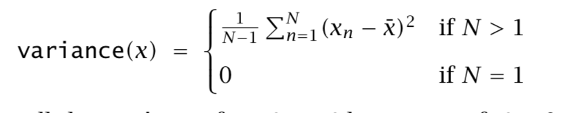
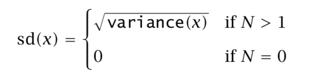
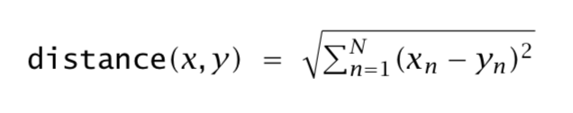
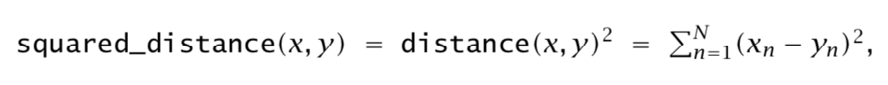

## 41. 配列の演算

### 41.1 配列から1つの値の作成
次の演算子は配列をインプットとしてとり、一つの値をアウトプットとして返すものです。
サイズ0の配列の境界値は，結合する操作(`min`,`max`,`sum`,あるいは`product`)に対応する単位になります。

#### 最小・最大
```text
real min(real x[])
```
`x`の中の最小値を返します。ただし、`x`のサイズが0の時は$+\infty$を返します。
```text
int min(int x[])
```
`x`の中の最小値を返します。ただし、`x`のサイズが0の時はエラーを返します。
```text
real max(real x[])
```
`x`の中の最大値を返します。ただし、`x`のサイズが0の時は$-\infty$を返します。
```text
int max(int x[])
```
`x`の中の最大値をします。ただし、`x`のサイズが0の時はエラーを返します。

#### 総和・総乗・Log Sum of Exp
```text
int sum(int x[])
```
`x`の要素の総和を返します。ただし、`x`のサイズ`N`によっては以下のように返します。


```text
real sum(real x[])
```
`x`の要素の総和を返します。上の定義を参照してください。
```text
real prod(real x[])
```
`x`の要素の総乗を返します。ただし、`x`のサイズが0の時は1を返します。
```text
real prod(int x[])
```
`x`の要素の総乗を返す。


```text
real log_sum_exp(real x[])
```
`x`の各要素のexpをとったものの総和の自然対数を返します。ただし、配列が空の時は$-\infty$を返します。

#### 標本平均・標本分散・標本標準偏差

標本平均，標本分散，および標準偏差は一般的な方法で計算されます。有限平均分布から互いに独立で同一の分布に従う(i.i.d.)標本を取ってくると，標本平均は分布の平均についての不偏推定量になります。同様に，有限分散分布から互いに独立で同一の分布に従う標本を取ってくると，標本分散は分散の不偏推定量になります^[$(N-1)$ではなく$N$で割ることで，分散の最尤推定値になりますが，これは分散を過少評価した偏った推定になります。]。標本標準偏差は標本分散の正の平方根として定義されますが，これはバイアスがありません。

```
real mean(real x[])
```

`x`の要素の標本平均を返します。サイズ$N>0$である配列`x`に対して，
$$ mean(x) = \bar{x} = \frac{1}{N} \sum_{n=1}^N x_n $$
で定義されます。ただし，配列のサイズが0のとき`mean`関数はエラーを返します。

```
real variance(real x[])
```

`x`の要素の標本分散を返します。サイズ$N>0$である配列`x`に対して，



で定義されます。ただし，配列のサイズが0のとき`variance`関数はエラーを返します。

```
real sd(real x[])
```
`x`の要素の標本標準偏差を返します。



配列のサイズが0のとき`sd`関数はエラーを返します。

#### ユークリッド距離と二乗距離

```
real distance(vector x, vector y)
```

`x`と`y`のユークリッド距離は，


で定義されます。ここで$N$は`x`および`y`のサイズです。サイズの等しくない引数を取った場合，`distance`関数はエラーを返します。


```
real distance(vector x, row_vector y)
```

`x`と`y`のユークリッド距離を返します。

```
real distance(row_vector x, vector y)
```

`x`と`y`のユークリッド距離を返します。

```
real distance(row_vector x, row_vector y)
```

`x`と`y`のユークリッド距離を返します。

```
real squared_distance(vector x, vector y)
```

`x`と`y`の距離の二乗は，



で定義されます。ここで$N$は`x`および`y`のサイズです。サイズの等しくない引数を取った場合，`squared_distance`関数はエラーを返します。


```
real distance(vector x, row_vector y[])
```

`x`と`y`のユークリッド距離の二乗を返します。

```
real distance(row_vector x, vector y[])
```

`x`と`y`のユークリッド距離の二乗を返します。

```
real distance(row_vector x, row_vector y[])
```

`x`と`y`のユークリッド距離の二乗を返します。

### 41.2 配列サイズと次元数関数

配列や行列のサイズは`dims()`関数を使えば得られます。`dims()`関数は8次元配列(および2次元行列)までのあらゆる変数を引数として取ることができ，次元数の整数の配列を返します。例えば，二つの変数が次のように宣言されていたとします。

```
real x[7,8,9];
matrix[8,9] y[7];
```

この時，`dim(x)`や`dim(y)`を呼ぶことで，7つ，8つ，9つの要素が含まれるサイズ3の整数配列がこの順で返されます。

`size()`関数は配列における要素の数を取り出します。これはトップレベルの要素だけに該当するので，もし配列の宣言が

```
real a[M,N];
```

のようになっていれば，`a`のサイズはMです。

これに対して`num_elements`関数は，全ての要素をチェックするので，上の`a`の場合は$M \times N$要素を返します。

特別な関数`rows()`と`cols()`は，ベクトルや行列の次元を取り出します。


```
int[] dims(T x)
```

`x`の次元を含む整数の配列を返します。引数`T`の型はどのStanの型でもよく，8配列次元まで許容します。

```
int num_elements(T[] x)
```

配列`x`における全ての要素の数を返し，そこには配列，ベクトル，行列の全ての要素が含まれます。`T`はどの配列型でも構いません。例えば，もし`x`が`real[4,3]`型であれば，`num_elements(x)`は12を返しますし，もし`y`が`matrix[3,4 y[5]`で宣言されていれば，`size(y)`は60を返します。

```
int size(T[] x)
```

配列`x`における要素の数を返します。配列`T`の型は何でも良いのですが，サイズは配列のトップレベルのサイズだけであり，含まれる要素の総数ではありません。例えば`x`が`real[4,3]`型であれば，`size(x)`は4です。

### 41.3 配列のブロードキャスト

以下の操作は指定されたサイズの配列を埋めるために，要素を繰り返し代入することで配列を作ります。これらの操作はあらゆる入力型`T`に作用しますので，実数，整数，ベクトル，行ベクトル，行列，配列のいずれでも構いません。

```
T[] rep_array(T x, int n)
```

全ての要素に`x`を割り当てた`n`の配列を返します。

```
T[] rep_array(T x, int m, int n)
```

全ての要素に`x`を割り当てた$m \times n$サイズの配列を返します。

```
T[ , , ] rep_array(T x, int k, int m, int n)
```

全ての要素に`x`を割り当てた，$k \times m \times n$サイズの配列を返します。

例えば,`rep_array(1.0,5)`は実数型配列(`real[]`型)でサイズが5，全ての値が1.0にセットされたものを作ります。一方で，`rep_array(1,5)`とすると，整数型配列(`int[]`型)でサイズが5，全ての値が1である配列を作ります。この違いは重要です。というのも，整数配列に実数配列を割り当てることができないからです。例えば，次の例では配列の参照，割り当ての適切な例と不適切な例を対比的に見ることができます。

```
real y[5];
int x[5];

x = rep_array(1,5);        //OK
y = rep_array(1.0,5);      //OK

x = rep_array(1.0,5);      // 不適切です
y = rep_array(1,5);        // 不適切です

x = y;                     // 不適切です
y = x;                     // 不適切です
```

もし`v`の値が繰り返しあるようなベクトルであれば(例えば`T`がベクトルであれば)，`rep_array(v,27)`はサイズ27の配列で，ベクトル`v`を27回コピーした要素を持ちます。

```
vector[5] v;
vector[5] a[3];
// ...
a = rep_array(v,3);    // vをコピーしたもので埋められます
a[2,4] = 9.0;          // v[4], a[1,4], a[2,4]は変化しません
```

もし型`T`それ自身が配列型であれば，結果もまた配列で，それは1,2,あるいは3つ次元の加えられたものになります。何次元加えられるかはどの`rep_array`関数が呼ばれたかによります。例えば，次の適切なコードスニペットをみてください。

```
real a[5,6];
real b[3,4,5,6];
// ..
b = rep_array(a,3,4);    // aを3 x 4回コピーしたものが作られます
b[1,1,1,1] = 27.9;       // a[1,1]要素は変化しません
```

`b`への割り当てが終わった後は，`b[j,k,m,n]`は`a[m,n]`と等しくなります。というのもそれらは，`j`が`1:3`，`k`が`1:4`，`m`が`1:5`，`n`が`1:6`で定義されているからです。


### 41.4 ソート関数

ソートは値やインデックスを，その数値の昇順，降順いずれかの順序で並べ変えるときに使います。例えば，`v`がサイズ3の配列で，次のような値を持っていたとします。

```
v(1,-10.3,20.987)
```

このとき，様々なソートルーチンがあります。

```
sort_asc(v) = (-10.3, 1, 20.987)
sort_desc(v) = (20.987, 1, -10.3)
sort_indices_asc(v) = (2,1,3)
sort_indices_desc(v) = (3,1,2)
```

```
real[] sort_asc(real[] v)
```

`v`の要素を昇順で並べ替えます。

```
int[] sort_asc(int[] v)
```

`v`の要素を昇順で並べ替えます。

```
real sort_desc(real[] v)
```

`v`の要素を降順で並べ替えます。

```
int[] sort_desc(int[] v)
```

`v`の要素を降順で並べ替えます。

```
int[] sort_indices_asc(real[] v)
```

`v`のインデックスを昇順に並べ替えた，1から`v`の間のインデックスがはいった配列を返します。

```
int[] sort_indices_asc(int[] v)
```

`v`のインデックスを昇順に並べ替えた，1から`v`の間のインデックスがはいった配列を返します。

```
int[] sort_indices_desc(intr[] v)
```

`v`のインデックスを降順に並べ替えた，1から`v`の間のインデックスがはいった配列を返します。

```
int[] sort_indices_desc(int[] v)
```

`v`のインデックスを降順に並べ替えた，1から`v`の間のインデックスがはいった配列を返します。

```
int rank(real[] v, int s)
```

`v[s]`よりも少ない`v`の要素数を返します。


```
int rank(int[] v int s)
```

`v[s]`よりも少ない`v`の要素数を返します。

